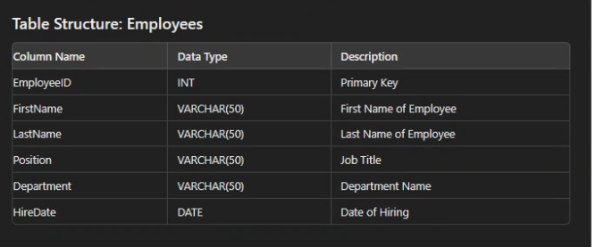
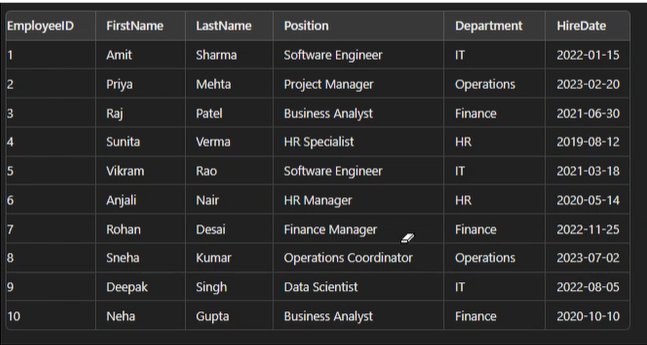

# SQL

## CRUD Operations
__C__ reate 
__R__ ead 
__U__ pdate 
__D__ elete 

### Create DB
~~~sql
create database collage
~~~

### Creating a table 
 
1. using GUI

<ul>
<li>Click on DB name</li>
<li>Right click on New -> Tables</li>
<li>Enter column name and datatype</li>
</ul>

2. using Code
~~~sql
create table tblGender1 
(ID int Not Null Primary Key,
Gender nvarchar(50))
~~~ 

### Altering table
~~~sql
Alter table tblPerson 
add constraint tblPerson_GenderId_FK Foreign Key
(GenderId) references tblGender(ID)
~~~

### Inserting values into the table
1. tblGender
~~~sql
INSERT INTO tblGender (Id, Gender)
VALUES (1, 'Male'),
(2, 'Female'),
(3, 'Others')
~~~
2. tblPerson
~~~sql
INSERT INTO tblPerson(Id, Name, Email, GenderId)
Values
(1, 'Tom', 'Tom@gmail.com', 1),
(2, 'Jessy', 'Jessy@gmail.com', 2),
(3, 'Kristy', 'Kristy@gmail.com', 2),
(4, 'John', 'John@gmail.com', 1),
(5, 'Rob', 'Rob@gmail.com', 1)
~~~

### Updating Records
1. Using Id
~~~sql
UPDATE tblPerson
SET Email = 'TomUpdated@gmail.com'
where Id = 1
~~~

2. Using Name
~~~sql
UPDATE tblPerson
SET GenderId = 1
WHERE Name = 'Jessy'
~~~

### Deleting Records
1. Using GenderId
~~~sql
DELETE FROM tblPerson
WHERE GenderId = 1
~~~

2. Using Id
~~~sql
DELETE FROM tblPerson
WHERE Id = 3
~~~

## Task - 1
Perform CRUD Operations on the following table

1. Create Table and Insert values
~~~sql
CREATE TABLE Employee 
(EmployeeID int Primary Key,
FirstName nVARCHAR(50) NOT NULL,
LastName nVARCHAR(50) NOT NULL,
Position nVARCHAR(50) NOT NULL,
Department nVARCHAR(50) NOT NULL,
HireDate DATE NOT NULL)
~~~
~~~sql
INSERT INTO Employee (EmployeeID, FirstName, LastName, Position, Department, HireDate)
VALUES
(1, 'John', 'Doe', 'Software Engineer', 'IT', '2022-01-15'),
(2, 'Jane', 'Smith', 'Marketing Manager', 'Marketing', '2021-06-23'),
(3, 'Emily', 'Johnson', 'HR Specialist', 'Human Resources', '2023-03-10'),
(4, 'Michael', 'Williams', 'Financial Analyst', 'Finance', '2020-09-30'),
(5, 'Sarah', 'Brown', 'Graphic Designer', 'Design', '2022-11-05')
~~~

2. Read Table
~~~sql
select * from Employee
~~~
~~~sql
select * from Employee
where Id = 3
~~~
~~~sql
select * from Employee 
where FirstName = 'Michael'
~~~
3. Update Table
~~~sql
UPDATE Employee
SET Position = 'Senior Graphic Designer'
where EmployeeId = 5
~~~
~~~sql
ALTER TABLE Employee
ALTER COLUMN Position nVARCHAR(100)
~~~

4. Delete Records
~~~sql
DELETE FROM Employee
where EmployeeID = 1
~~~

~~~sql
DELETE FROM Employee 
where FirstName = 'Sarah'
~~~

## Other Operatios on table

Create the above table Employee and delete previous entries from the table.
~~~sql
INSERT INTO Employee(EmployeeID, FirstName, LastName, Position, Department, HireDate)
Values
(1 ,'Amit', 'Sharma', 'Software Engineer', 'IT', '2022-01-15'),
(2 ,'Priya', 'Mehta', 'Project Manager', 'Operations', '2023-02-20'),
(3 ,'Raj', 'Patel', 'Business Analyst', 'Finance', '2021-06-30'),
(4 ,'Sunita', 'Verma', 'HR Specialist', 'HR', '2019-08-12'),
(5 ,'Vikram', 'Rao', 'Software Engineer', 'IT', '2021-03-18'),
(6, 'Anjali', 'Nair', 'HR Manager', 'HR', '2020-05-14'),
(7, 'Rohan', 'Desai', 'Finance Manager', 'Finance', '2022-11-25'),
(8, 'Sneha', 'Kumar', 'Operations Coordinator', 'Operations', '2023-07-02'),
(9, 'Deepak', 'Singh', 'Data Scientist', 'IT', '2022-08-05'),
(10, 'Neha', 'Gupta', 'Business Analyst', 'Finance', '2020-10-10')
~~~

### select Query
1. Selecting data based on __Columns__
~~~sql
select FirstName, LastName, Department
FROM Employee
~~~

2. Selecting data based on __Rows__
~~~sql
select * 
FROM Employee
WHERE Department = 'IT'
~~~

3. Selecting data based on __Values__ 
~~~sql
select *
FROM Employee
WHERE HireDate > '2022-01-01'
~~~

### Other Queries
1. IN Keyword
~~~sql
select * 
FROM Employee
WHERE Department IN ('IT', 'HR')
~~~

2. DISTINCT Keyword
~~~sql
select DISTINCT Department
FROM Employee
~~~

3. AND Keyword
~~~sql
select * 
FROM Employee
WHERE Department = 'IT' AND HireDate > '2022-01-01'
~~~

4. OR Keyword
~~~sql
select * 
FROM Employee
WHERE Department = 'IT' OR HireDate >'2022-01-01'
~~~

5. BETWEEN and AND Queries
~~~sql
select * 
FROM Employee
WHERE HireDate BETWEEN '2022-01-01' AND '2022-12-31'
~~~

6. % Keyword
~~~sql
select * 
FROM Employee
WHERE LastName LIKE 'S%'
~~~

7. Column Alias
~~~sql
select FirstName+' '+LastName AS FullName, Department
FROM Employee
~~~

8. Table Alias
~~~sql
select E.FirstName, E.LastName, E.Department
FROM Employee as E
WHERE E.Department = 'IT'
~~~

9. COUNT Function
~~~sql
SELECT count(*)
AS EmployeeCount FROM Employee

SELECT Department, Count(*) AS EmployeeCount
FROM Employee
GROUP BY Department
~~~

### Create another table Department for JOINS
~~~sql
CREATE TABLE Departments(
	DepartmentID INT PRIMARY KEY,
	DepartmentName VARCHAR(50)
)

INSERT INTO Departments(DepartmentID, DepartmentName)
VALUES
(1, 'IT'),
(2, 'HR'),
(3, 'Finance'),
(4, 'Operations')
~~~

## Joins
1. Using JOIN keyword
~~~sql
select e.EmployeeID, e.FirstName, e.LastName, e.Position, d.DepartmentName
from Employee e
JOIN Departments d ON e.Department = d.DepartmentName
~~~

2. LEFT JOIN keyword
~~~sql
select FirstName, LastName
FROM Employee
WHERE Hiredate = (SELECT MIN (HireDate) from Employee)
~~~

3. List of people who are in more than two departments
~~~sql
select FirstName+' '+LastName AS FullName
FROM Employee
where Department IN(
	select Department
	from Employee
	GROUP BY Department
	having COUNT(*) > 2
)
~~~
