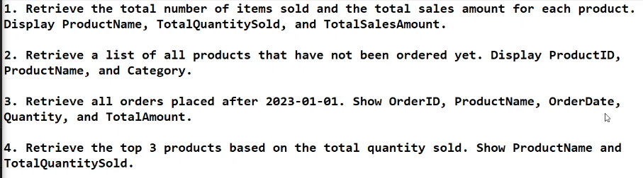
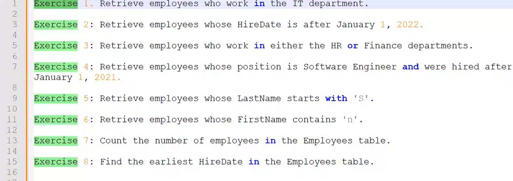
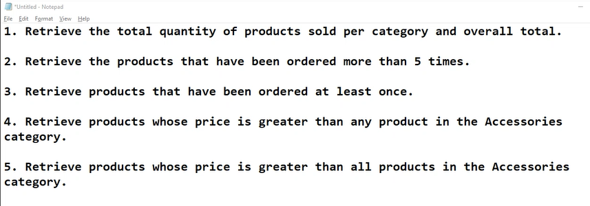

# Day 3

## Activity

1. 
~~~sql
select product_name AS ProductName,  SUM(quantity) AS TotalQuantitySold, SUM(price) AS TotalSalesAmount
from Products p
JOIN Orders o
ON p.product_id = o.product_id
GROUP BY p.product_name
~~~

2. 
~~~sql
SELECT p.product_id, p.product_name
FROM Products p
LEFT JOIN Orders o ON p.product_id = o.product_id
WHERE o.order_id IS NULL
~~~

3. 
~~~sql
SELECT o.order_id, p.product_name, o.order_date, o.quantity, p.price
FROM Orders o
INNER JOIN Products p ON o.product_id= p.product_id
WHERE o.order_date > '2023-01-01'
~~~

4. 
~~~sql
SELECT Top 3 p.product_name, SUM(o.quantity) AS TOtalQuantitySold
From orders o
INNER JOIN Products p ON o.product_id = p.product_id
GROUP BY p.product_name
ORDER BY TotalQuantitySold DESC
~~~

## Activity

1. 
~~~sql
select FirstName+' '+LastName AS Employee_Name from Employee
where Department LIKE 'IT%'
~~~

2. 
~~~sql
select FirstName+' '+LastName AS Employee_Name, HireDate from Employee
where HireDate > '2022-01-01'
~~~

3. 
~~~sql
select FirstName+' '+LastName AS Employee_Name, Department 
FROM Employee
WHERE Department LIKE 'HR' OR Department LIKE 'Finance'
~~~

4. 
~~~sql
select FirstName+' '+LastName AS Employee_Name, Position
from Employee
where Position LIKE 'Software Engineer' AND HireDate > '2021-01-01'
~~~

5. 
~~~sql
select FirstName+' '+LastName AS Employee_Name
from Employee
where LastName LIKE 'S%'
~~~

6. 
~~~sql
select FirstName+' '+LastName AS Employee_Name
from Employee
where FirstName LIKE '%n%'
~~~

7. 
~~~sql
select COUNT(*) AS Number_of_employees
from Employee
~~~

8. 
~~~sql
select MIN(HireDate) AS Minimum_HireDate
from Employee
~~~

### Multiple Clauses
~~~sql
SELECT DISTINCT p.product_name, p.price, o.order_date
FROM Products as p
INNER JOIN Orders AS o ON p.product_id = o.product_id
WHERE o.order_date > '2024-01-01'
AND p.price BETWEEN 5000 AND 50000
AND p.product_name LIKE 'S%'
~~~

### Pairing
~~~sql
SELECT p1.product_name AS Product1, p2.product_name AS Product2
FROM Products p1
INNER JOIN Products p2 ON p1.product_id <> p2.product_id
~~~

### HAVING clause
~~~sql
SELECT p.Category, SUM(o.Quantity) AS TotalQuantity
FROM Orders o
INNER JOIN Products p ON p.product_id = p.product_id
GROUP BY p.Category
HAVING SUM(o.Quantity) > 3
~~~

### Exercises

2. 
~~~sql
SELECT product_name
FROM Products
WHERE product_id IN(
	SELECT product_id
	from Orders
	GROUP BY product_id
	HAVING COUNT(order_id) > 5
)
~~~

3. 
~~~sql
select product_name
FROM Products p
WHERE EXISTS(
	SELECT 1
	FROM Orders o
	WHERE o.product_id = p.product_id
)
~~~

4. 
~~~sql
SELECT product_name
FROM Products 
WHERE Price > ALL(
    SELECT Price
    FROM Products
    WHERE Category = 'Accessories'
)
~~~

5. 
~~~sql
select product_name
FROM Products p
WHERE EXISTS(
	SELECT 1
	FROM Orders o
	WHERE o.product_id = p.product_id
)
~~~

### Constraints
~~~sql
CREATE TABLE Products(
	ProductID INT PRIMARY KEY, --Enforces unique ProductID
	ProductName VARCHAR(100) NOT NULL, --Prevents NULL values for ProductName
	Category VARCHAR(50) NOT NULL,
	Price DECIMAL(10, 2) CHECK (Price > 0), --Ensures Price > 0
	StockQuantity INT DEFAULT 0 --Sets default value 0
)
~~~

### Functions
1. UPPER()
~~~sql
SELECT product_name, UPPER(Product_name) AS ProductNameUpperCase
FROM Products
~~~

2. LOWER()
~~~sql
SELECT product_name, LOWER(Product_name) AS ProductNameUpperCase
FROM Products
~~~

3. SUBSTRING()
~~~sql
SELECT product_name, SUBSTRING(Product_name, 1, 3) AS ProductNameUpperCase
FROM Products
~~~

4. REPLACE()
~~~sql
SELECT product_name, REPLACE(Product_name, 'Phone', 'Device') AS ProductNameUpperCase
FROM Products
~~~

5. LEN()
~~~sql
SELECT product_name, LEN(Product_name) AS ProductNameUpperCase
FROM Products
~~~

6. LTRIM()
~~~sql
SELECT product_name, LTRIM(RTRIM(Product_name)) AS ProductNameUpperCase
FROM Products
~~~

7. RTRIM()
~~~sql
SELECT product_name, LTRIM(RTRIM(Product_name)) AS ProductNameUpperCase
FROM Products
~~~

8. CHARINDEX()
~~~sql
SELECT product_name, CHARINDEX('e',Product_name) AS PositionOfE
FROM Products
~~~

9. CONCAT()
~~~sql
SELECT product_name, product_id, CONCAT(product_name, '-', product_id) AS ProductDetails
FROM Products
~~~

10. LEFT()
~~~sql
SELECT product_name, LEFT(product_name, 5)AS ShortName
FROM Products
~~~

11. RIGHT()
~~~sql
SELECT product_name, RIGHT(product_name, 5)AS LastCharacters
FROM Products
~~~

12. REVERSE()
~~~sql
SELECT product_name, REVERSE(product_name) AS ReversedName
FROM Products
~~~

13. FORMAT()
~~~sql
SELECT product_name, FORMAT(price, 'N2') AS FormattedPrice
FROM Products
~~~

14. REPLICATE()
~~~sql
SELECT product_name, REPLICATE(product_name, 3) AS RepeatedProductName
FROM Products
~~~

15. DATE FUNCTIONS
~~~sql
SELECT GETDATE() AS CurrentDate,
DATEADD(DAY, 10, GETDATE()) AS FutureDate

SELECT DATEADD(YEAR, -22, GETDATE()) AS DateMinus22Years

SELECT DATEDIFF(DAY, '2024-01-01', GETDATE()) AS DaysDifference

SELECT FORMAT(GETDATE(), 'MMMM dd, yyyy') AS FormattedDate

SELECT FORMAT(GETDATE(), 'dd-MMMM-yyyy') AS FormattedDate

SELECT GETDATE() AS CurrentDate

SELECT YEAR(GETDATE()) AS CurrentYear

SELECT MONTH('2024-05-15') AS MonthExtracted

SELECT DAY('2024-05-15') AS DayExtracted

--The EOMONTH function simplifies this task by directly returning the last day of the month for any specified date.
SELECT DAY(EOMONTH('1942-02-08')) AS LastDayOfMonth
~~~

__MM__ - Gives Month number (08)

__MMMM__ - Gives full Month name (August)

Find the number of months since your birthday

~~~sql
SELECT DATEDIFF(MONTH, '2023-08-23', GETDATE()) AS MonthsDiff
~~~

