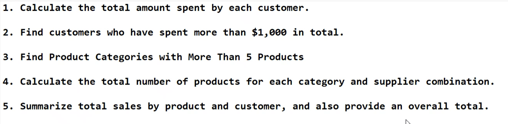
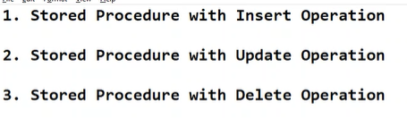

# Day 4

## Math Functions

~~~sql
SELECT ProductName, Price, ROUND(Price, 2) AS RoundedPrice
FROM Products;
~~~

~~~sql
SELECT ProductName, Price, CEILING(Price) AS CeilingPrice
FROM Products;
~~~

~~~sql
SELECT ProductName, Price, FLOOR(Price) AS FloorPrice
FROM Products;
~~~

~~~sql
SELECT ProductName, Price, SQRT(Price) AS SquareRootPrice
FROM Products;
~~~

~~~sql
SELECT ProductName, Price, POWER(Price, 2) AS PriceSquared
FROM Products;
~~~

~~~sql
SELECT ProductName, Price, Price % 5 AS ModulusPrice
FROM Products;
~~~

~~~sql
SELECT ABS(MAX(Price) - MIN(Price)) AS PriceDifference
FROM Products;
~~~

~~~sql
SELECT ProductName, Price, ROUND(RAND()*100, 2) AS RandomDiscountPercentage
FROM Products;
~~~

~~~sql
SELECT ProductName, Price, LOG(Price) AS LogarithmPrice
FROM Products;
~~~

### Activity
1. Apply a 15% discount, round the discounted price to 2 decimal places, and show both the ceiling and floor values of the final discounted price.

Solution

~~~sql
SELECT 
	ProductName,
	Price,
	ROUND(Price * 0.85, 2) AS DiscountedPrice
	CEILING(ROUND(Price * 0.85, 2)) AS CeilingDiscountedPrice
	FLOOR(ROUND(Price * 0.85, 2)) AS FloorDiscountedPrice
FROM Products;
~~~

### Aggregate Function

```sql
SELECT SUM(TotalAmount) AS TotalSales
FROM Orders;
```

~~~sql
SELECT AVG(Price) AS AveragePrice
FROM Products;
~~~

~~~sql
SELECT COUNT(OrderID) AS TotalOrders
FROM Orders;
~~~

~~~sql
SELECT MIN(Price) AS MinPrice, MAX(Price) AS MaxPrice
FROM Products;
~~~

~~~sql
SELECT Category, COUNT(ProductID) AS ProductCount
FROM Products
GROUP BY Category;
~~~

## Exercise

1. 
~~~sql
SELECT ID, Name, SUM(PurchaseAmt) AS TotalAmountSpent
FROM Customer
GROUP BY ID, Name
~~~

2. 
~~~sql
SELECT ID, Name
FROM Customer
GROUP BY ID, Name
HAVING SUM(PurchaseAmt) > 1000
~~~

3. 
~~~sql
SELECT Category 
FROM Products 
GROUP BY Category
HAVING COUNT(*) > 5
~~~

4. 
~~~sql
SELECT CategoryID, SupplierID, COUNT(ProductID) AS TotalProducts
FROM Products
GROUP BY CategoryID, SupplierID
~~~

5. 
~~~sql
SELECT product_id, customer_id, SUM(Amount) AS TotalSales
FROM Products
GROUP BY product_id, customer_id
~~~

## Stored Procedures
Used because
1. It is secure - Because in a procedure we can hide the queries and execute only by Procedure name.
2. It is reusable
3. It is fast because when we create a procedure it gets stored in the cache and when we execute it, the procedure runs from the cache and hence it is fast
4. We can combine 2 or more queries in a stored procedure.
~~~sql
CREATE PROCEDURE GetAllProducts
AS
BEGIN
	SELECT * FROM Products;
END;

exec GetAllProducts
~~~ 

~~~sql
CREATE PROCEDURE GetAllProducts22
AS
BEGIN
	SELECT * FROM Products;
	SELECT * FROM Orders;
END;
~~~

### Procedure accepting parameters
1. Taking input in a stored procedure
~~~sql
CREATE PROCEDURE GetProductByID
	@ProductID INT
AS
BEGIN
	SELECT *
	FROM Products
	WHERE product_id = @ProductID
END;

EXEC GetProductByID @ProductID = 1;
~~~

2. Taking multiple inputs in a stored procedure
~~~sql
CREATE PROCEDURE GetProductByCategoryAndPrice
	@Category VARCHAR(50),
	@MinPrice DECIMAL(10, 2)
AS
BEGIN
	SELECT *
	FROM Products
	WHERE Category = @Category
	AND Price >= @MinPrice
END;

EXEC GetProductByCategoryAndPrice @Category = 'Electronics', @MinPrice = 500.00;
~~~

### Activity


1. 
~~~sql
CREATE PROCEDURE InsertByValue
	@ProductID INT,
	@ProductName VARCHAR(50),
	@Price DECIMAL(10, 2),
	@Category VARCHAR(50)
AS
BEGIN
	INSERT INTO Products(product_id, product_name, price, Category)
	VALUES
	(@ProductID, @ProductName, @Price, @Category);
END;

EXEC InsertByValue @ProductID = 11, @ProductName = 'Earphones', @Price = 300.00, @Category = 'Accessories';
~~~

2. 
~~~sql
CREATE PROCEDURE UpdateByValue
	@ProductID INT,
	@Price DECIMAL(10, 2)
AS
BEGIN
	UPDATE Products
	SET price = @Price
	WHERE product_id = @ProductID
END;

EXEC UpdateByValue @ProductID = 11, @Price = 400.00;
~~~

3. 
~~~sql
CREATE PROCEDURE DeleteByValue
	@ProductID INT
AS
BEGIN
	DELETE FROM Products WHERE
	product_id = @ProductID
END;

EXEC DeleteByValue @ProductID = 11;
~~~

### Procedure Giving output
~~~sql
CREATE PROCEDURE GetTotalProductsInCategory
	@Category VARCHAR(50),
	@TotalProducts INT OUTPUT
AS
BEGIN
	SELECT @TotalProducts = COUNT(*)
	FROM Products
	WHERE Category = @Category;
END;

DECLARE @Total INT;
EXEC GetTotalProductsInCategory @Category = 'Accessories', @TotalProducts = @Total OUTPUT;
SELECT @Total AS TotalProductsInCategory; 
~~~

## Transactions
### Placing an order
1. There is a kind of try and catch block in transactions.
2. When we place an order then there is nothing in between either the order is placed or it is not.
3. ROLLBACK TRANSACTION - The transaction is reversed using ROLLBACK if any error occurs we will give this ROLLBACK in the CATCH block.
4. Whenever we have dependent statements we wrap them up in transactions like INSERT and UPDATE in below example. 
~~~sql
CREATE PROCEDURE ProcessOrder
	@OrderID INT,
	@ProductID INT, 
	@Quantity INT,
	@OrderDate DATE
AS
BEGIN
	BEGIN TRANSACTION;

	BEGIN TRY
		--Insert order
		INSERT INTO Orders(order_id, product_id, quantity, order_date)
		VALUES (@OrderID, @ProductID, @Quantity, @OrderDate);

		--Update order stock
		UPDATE Products
		SET StockQuantity = StockQuantity - @Quantity
		WHERE product_id = @ProductID;

		COMMIT TRANSACTION;
	END TRY
	BEGIN CATCH
		ROLLBACK TRANSACTION;
		--You can handle errors here, sych as logging or returning an error message
		THROW;
	END CATCH;
END;

EXEC ProcessOrder @OrderID = 15,@ProductID = 1, @Quantity = 2, @OrderDate = '2024-08-23';
~~~

### IF ELSE Block in Transactionsame pace
1. Adjustment of Stock
~~~sql
CREATE PROCEDURE AdjustStock
	@ProductID INT,
	@Adjustment INT
AS
BEGIN
	IF @Adjustment > 0
	BEGIN
		--Add to stock
		UPDATE Products
		SET StockQuantity = StockQuantity + @Adjustment
		WHERE product_id = @ProductID;
	END
	ELSE IF @Adjustment < 0
	BEGIN
		--Subtract from stock
		UPDATE Products
		SET StockQuantity = StockQuantity + @Adjustment
		WHERE product_id = @ProductID;
	END
END;

EXEC AdjustStock @ProductID = 1, @Adjustment = 5; --Increase stock by 5
EXEC AdjustStock @ProductID = 1, @Adjustment = -3; --Decrease stock by 3
~~~

## Coding Assessment
1. Hands-on Exercise: Filtering Data using SQL Queries
Retrieve all products from the Products table that belong to the category 'Electronics' and have a price greater than 500.
~~~sql
select * 
FROM Products 
WHERE Category = 'Electronics' AND price > 500
~~~

2. Hands-on Exercise: Total Aggregations using SQL Queries
Calculate the total quantity of products sold from the Orders table.
~~~sql
SELECT SUM(Quantity) AS TotalQuantitySold
FROM Orders
~~~

3. Hands-on Exercise: Group By Aggregations using SQL Queries
Calculate the total revenue generated for each product in the Orders table.
~~~sql
SELECT SUM(TotalAmount) AS TotalRevenueGenerated
FROM Orders
~~~

4. Hands-on Exercise: Order of Execution of SQL Queries
Write a query that uses WHERE, GROUP BY, HAVING, and ORDER BY clauses and explain the order of execution.
~~~sql
SELECT CustomerID, SUM(TotalAmount) AS TotalSpent
FROM Orders
WHERE OrderDate >= '2024-07-23'
GROUP BY CustomerID
HAVING SUM(TotalAmount) > 50000
ORDER BY TotalSpent DESC
~~~

5. Hands-on Exercise: Rules and Restrictions to Group and Filter Data in SQL Queries
Write a query that corrects a violation of using non-aggregated columns without grouping them.
~~~sql
--Wrong Code
SELECT ProductID, Category, SUM(price) AS CategoryPrice
FROM Products
GROUP BY Category

--Corrected code
SELECT MAX(ProductID) AS ProductID, Category, SUM(price) AS CategoryPrice
FROM Products
GROUP BY Category
~~~

6. Hands-on Exercise: Filter Data based on Aggregated Results using Group By and Having
Retrieve all customers who have placed more than 5 orders using GROUP BY and HAVING clauses.
~~~sql
SELECT CustomerID, CONCAT(FirstName,' ',LastName)AS Name, Email, PhoneNumber
FROM Customers
WHERE CustomerID IN(
	SELECT CustomerID
	FROM Orders
	GROUP BY CustomerID
	HAVING COUNT(CustomerID) > 5
)
~~~


7. Basic Stored Procedure
Create a stored procedure named GetAllCustomers that retrieves all customer details from the Customers table.
~~~sql
CREATE PROCEDURE GetAllCustomers
AS
BEGIN
	SELECT * FROM Customers;
END;

exec GetAllCustomers;
~~~

8. Stored Procedure with Input Parameter
Create a stored procedure named GetOrderDetailsByOrderID that accepts an OrderID as a parameter and retrieves the order details for that specific order.
~~~sql
CREATE Procedure GetOrderDetailsByOrderID
	@OrderID INT
AS
BEGIN
	SELECT * 
	FROM Orders
	WHERE OrderID = @OrderID
END;

EXEC GetOrderDetailsByOrderID @OrderID = 1;
~~~

9. Stored Procedure with Multiple Input Parameters
Create a stored procedure named GetProductsByCategoryAndPrice that accepts a product Category and a minimum Price as input parameters and retrieves all products that meet the criteria.
~~~sql
CREATE PROCEDURE GetProductsByCategoryAndPrice
	@Category VARCHAR(50),
	@MinimumPrice DECIMAL(10, 2)
AS
BEGIN
	SELECT *
	FROM Products
	WHERE Category = @Category AND Price >= @MinimumPrice
END;

EXEC GetProductsByCategoryAndPrice @Category = 'Electronics', @MinimumPrice = 20000;
~~~

10. Stored Procedure with Insert Operation
Create a stored procedure named InsertNewProduct that accepts parameters for ProductName, Category, Price, and StockQuantity and inserts a new product into the Products table.
~~~sql
CREATE PROCEDURE InsertNewProduct
	@ProductName VARCHAR(50),
	@Category VARCHAR(50),
	@Price DECIMAL(10, 2),
	@StockQuantity INT
AS
BEGIN
	INSERT INTO Products(ProductName, Category, Price, StockQuantity)
	VALUES
	(@ProductName, @Category, @Price, @StockQuantity);
END;

EXEC InsertNewProduct @ProductName = 'Head Phones', @Category = 'Electronics', @Price = 2500, @StockQuantity = 10
~~~

11. Stored Procedure with Update Operation
Create a stored procedure named UpdateCustomerEmail that accepts a CustomerID and a NewEmail parameter and updates the email address for the specified customer.
~~~sql
CREATE PROCEDURE UpdateCustomerEmail 
	@CustomerID INT,
	@NewMail VARCHAR(100)
AS
BEGIN
	UPDATE Customers
	SET Email = @NewMail
	WHERE CustomerID = @CustomerID;
END;

EXEC UpdateCustomerEmail @CustomerID = 2, @NewMail = 'mehta.priya@example.com';
~~~

12. Stored Procedure with Delete Operation
Create a stored procedure named DeleteOrderByID that accepts an OrderID as a parameter and deletes the corresponding order from the Orders table.
~~~sql
CREATE PROCEDURE DeleteOrderById
	@OrderID INT
AS
BEGIN
	DELETE FROM Orders
	WHERE OrderID = @OrderID
END;

EXEC DeleteOrderById @OrderID = 5;
~~~

13. Stored Procedure with Output Parameter
Create a stored procedure named GetTotalProductsInCategory that accepts a Category parameter and returns the total number of products in that category using an output parameter.
~~~sql
CREATE PROCEDURE GetTotalProductsInCategory
	@Category VARCHAR(50),
	@TotalProducts INT OUTPUT
AS
BEGIN
	SELECT @TotalProducts = COUNT(*)
	FROM Products
	WHERE Category = @Category;
END;

DECLARE @Total INT;
EXEC GetTotalProductsInCategory @Category = 'Electronics', @TotalProducts = @Total OUTPUT;
SELECT @TOTAL AS TotalProductsInCategory;
~~~


