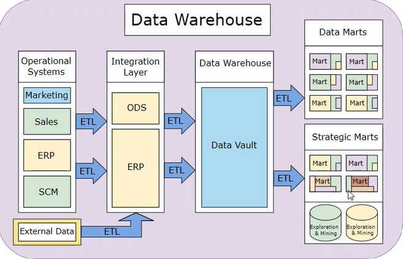
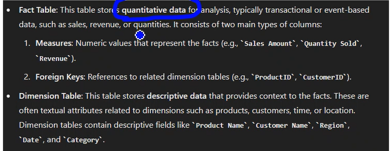
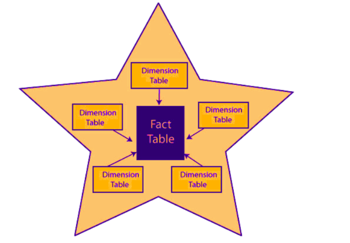
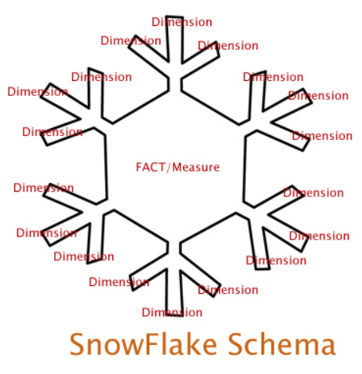

# Day 5

## Cleaning of Data And Filtering it
1. If data is taking a particular direction then data is bad data.

2. The Machine Learning model is trained because of the data we feed into it like product pairing or recommendations in Amazon and this happens because of machine learning models 

3. Logos are designed with red colour because it is attractive.

4. Instagram reels offer infinitive scrolling
Pulling is used because of casino.

5. We deal with data, data manipulation we need to remove spaces and remove redundant data to get good data .

#### Data driven decisions 
1. A machine learning model gets confused because of uppercase letters and this is called noise.
2. Thus we clean up data firstly by converting the data to lowercase removing spaces and some words;
Is, a, the, are, adverbs are also noise words.  

### Data Cleaning
1. Converting Uppercase to Lowercase to reduce noise
~~~sql
UPDATE Customers
SET FirstName = LTRIM(RTRIM(LOWER(FirstName))),
	LastName = LTRIM(RTRIM(LOWER(LastName)));
~~~

2. Filtering Data 
~~~sql
SELECT * 
FROM Customers
WHERE FirstName LIKE 'A%';
~~~

3. Checking proper format of data
~~~sql
SELECT * 
FROM Customers
WHERE PhoneNumber LIKE '[0-9][0-9][0-9]-[0-9][0-9][0-9]-[0-9][0-9][0-9][0-9]'
~~~

4. Filtering data based on number of characters
~~~sql
SELECT * 
FROM Customers 
WHERE LastName LIKE '_____'
~~~

### Partitioning
Partition is done here to see who has spent the most money
~~~sql
SELECT CustomerID, TotalAmount, SUM(TotalAmount) OVER (PARTITION BY CustomerID ORDER BY OrderDate) AS RunningTotal
FROM Orders;
~~~
PARTITION shows running data like given below

|CustomerID|OrderID|MoneySpent|TotalMoneySpent|
|-----------|------|---------|----------------|
|1|1|400.00|400.00|
|1|2|500.00|900.00|
|1|3|200.00|1100.00|
|2|4|500.00|500.00|
|2|5|700.00|1200.00|

### Ranking
RANK(): Gives each row a rank according to specific ordering. 
~~~sql
SELECT CustomerID, TotalSales, RANK() OVER (ORDER BY TotalSales DESC) AS SalesRank
FROM(
	SELECT CustomerID, SUM(TotalAmount) AS TotalSales
	FROM Orders
	GROUP BY CustomerID
) AS SalesData
~~~

### CTE: Common Table Expression
__CTE__ is a temporary result set that can be used in a query, and is similar to a derived table. 
Defined using __WITH__ keyword. 
__CTE__ helps to keep your code organized and allows us to reuse the results in the same query, and perform multi-level aggregations
~~~sql
WITH RecursiveEmployeeCTE AS (
	SELECT EmployeeID, ManagerID, EmployeeName
	FROM Employees
	WHERE ManagerID IS NULL
	UNION ALL
	SELECT e.EmployeeID, e.ManagerID, e.EmployeeName
	FROM Employees e
	INNER JOIN RecursiveEmployeeCTE r ON e.ManagerID = r.EmployeeID
)

SELECT * FROM RecursiveEmployeeCTE;
~~~
Anchor member is the member here who has no manager that is manager_id is NULL 👇
~~~sql
SELECT EmployeeID, ManagerID, EmployeeName
	FROM Employees
	WHERE ManagerID IS NULL
~~~

People who are reporting to the this top level guy
Then ppl reporting to the ppl on upper post in a recursive manner.
Here basically we are trying to get who is Reporting to whom 👇
~~~sql
SELECT e.EmployeeID, e.ManagerID, e.EmployeeName
	FROM Employees e
	INNER JOIN RecursiveEmployeeCTE r ON e.ManagerID = r.EmployeeID
~~~

We are joining the table by itself using UNION ALL it leads to recursion 
The below code is deciding if the loop should continue or not.
~~~sql
RecursiveEmployeeCTE r ON e.ManagerID = r.EmployeeID
~~~

### ROLLUP()
~~~sql
SELECT Category, SUM(Amount) AS TotalSales
FROM Sales
GROUP BY ROLLUP(Category);
~~~
Enables a SELECT statement to calculate multiple levels of subtotals across a specified group of dimensions.

Explanation
~~~sql
SELECT Category, SUM(Amount) AS TotalSales
FROM Sales
GROUP BY Category;
~~~
Output:
|Category|TotalSales|
|--------|----------|
|Electronics|4700.00|
Furniture|1700.00|

~~~sql
SELECT Category, SUM(Amount) AS TotalSales
FROM Sales
GROUP BY ROLLUP(Category);
~~~
Output:
|Category|TotalSales|
|--------|----------|
|Electronics|4700.00|
|Furniture|1700.00|
|NULL|6400.00|

### Correlated Subquery
1. Finding customer who has placed more than one order
~~~sql
SELECT DISTINCT o1.CustomerID
FROM Orders2 o1
WHERE(
	SELECT COUNT(*)
	FROM Orders2 o2
	WHERE o2.CustomerID = o1.CustomerID
) > 1;
~~~

### Materialized View
A duplicate data table created by combining data from multiple existing tables for faster data retrieval

View and table are combined using SCHEMABINDING
and this bindes the view and the parent table.

1. It is made on top of an existing column.
2. Creating view of a common column.

~~~sql
CREATE VIEW TotalSalesByProduct
WITH SCHEMABINDING
AS
SELECT ProductID, SUM(Amount) AS TotalSales
FROM dbo.ProductSales
GROUP BY ProductID;
~~~

The above code should be the only statement in the query.

~~~sql
SELECT * FROM
TotalSalesByProduct
~~~

## Activity - Hands ON
1. Filter and Aggregate on Join Results using SQL
- Task: Join the `Orders` and `Customers` tables to find the total order amount per customer and filter out customers who have spent less than $1,000.
~~~sql
SELECT c.CustomerID, SUM(o.TotalAmount) AS TotalAmountSpent
FROM Orders o
JOIN Customers c
ON o.CustomerID = c.CustomerID
GROUP BY c.CustomerID
HAVING SUM(o.TotalAmount) > 1000
~~~

2. Cumulative Aggregations and Ranking in SQL Queries
- Task: Create a cumulative sum of the `OrderAmount` for each customer to track the running total of how much each customer has spent.
~~~sql
SELECT CustomerID, TotalAmount, SUM(TotalAmount), RANK() OVER(PARTITION BY CustomerID ORDER BY OrderDate) AS OrderAmount
FROM Orders;
~~~

3. OVER and PARTITION BY Clause in SQL Queries
- Task: Rank the customers based on the total amount they have spent, partitioned by city.
~~~sql
SELECT CustomerID, City, TotalSpent, RANK() OVER (PARTITION BY City ORDER BY TotalSpent DESC) AS CustomerRank
FROM(
	SELECT CustomerID, City, SUM(TotalAmount) AS TotalSpent
	FROM Orders
	GROUP BY CustomerID
) AS CustomerTotals;
~~~

4. Total Aggregation using OVER and PARTITION BY in SQL Queries
- Task: Calculate the total amount of all orders (overall total) and the percentage each customer's total spending contributes to the overall total.
~~~sql
SELECT CustomerID, TotalSpent, OverallTotal, ROUND((TotalSpent/OverallTotal)*100, 2) AS PercentageContribution
FROM(
	SELECT CustomerID, SUM(TotalAmount) AS TotalSpent, SUM(SUM(TotalAmount)) OVER() AS OverallTotal
	FROM Orders
	GROUP BY CustomerID	
)AS CustomerTotals
ORDER BY PercentageContribution
~~~

5. Ranking in SQL
- Task: Rank all customers based on the total amount they have spent, without partitioning.
~~~sql
SELECT CustomerID, TotalSales, RANK() OVER (ORDER BY TotalSales DESC) AS SalesRank
FROM(
	SELECT CustomerID, SUM(TotalAmount) AS TotalSales
	FROM Orders
	GROUP BY CustomerID
) AS SalesData
~~~

Here are additional tasks that build on the concepts of filtering, aggregating, ranking, and window functions in SQL:

6. Task: Calculate the Average Order Amount per City
- Task: Write a query that joins the `Orders` and `Customers` tables, calculates the average order amount for each city, and orders the results by the average amount in descending order.
~~~sql
SELECT c.City, AVG(o.TotalAmount) AS AverageAmount
FROM Orders o
JOIN Customers c
ON o.CustomerID = c.CustomerID
GROUP BY City
ORDER BY AverageAmount;
~~~

7. Task: Find Top N Customers by Total Spending
- Task: Write a query to find the top 3 customers who have spent the most, using `ORDER BY` and `LIMIT`.
~~~sql
SELECT TOP 3 CustomerID, SUM(TotalAmount) AS TotalSpent
FROM Orders
GROUP BY CustomerID
ORDER BY TotalSpent DESC;
~~~

8. Task: Calculate Yearly Order Totals
- Task: Write a query that groups orders by year (using `OrderDate`), calculates the total amount of orders for each year, and orders the results by year.
~~~sql
SELECT YEAR(OrderDate) AS OrderYear, SUM(TotalAmount) AS YearTotal
FROM Orders
GROUP BY YEAR(OrderDate)
ORDER BY OrderYear
~~~

9. Task: Calculate the Rank of Customers by Total Order Amount
- Task: Write a query that ranks customers by their total spending, but only for customers located in "Mumbai". The rank should reset for each customer in "Mumbai".
~~~sql
SELECT c.CustomerID, c.City, SUM(o.TotalAmount) AS TotalSpent, RANK() OVER(ORDER BY SUM(o.TotalAmount) DESC) AS CustomerRank
FROM Orders o
JOIN Customers c ON o.CustomerID = c.CustomerID
WHERE c.City = 'Mumbai'
GROUP BY c.CustomerID, c.City
ORDER BY CustomerRank
~~~

10. Task: Compare Each Customer's Total Order to the Average Order Amount
- Task: Write a query that calculates each customer's total order amount and compares it to the average order amount for all customers.
~~~sql
WITH CustomerTotals AS (
    SELECT CustomerID, SUM(TotalAmount) AS TotalSpent
    FROM Orders
    GROUP BY CustomerID
),
AverageOrder AS (
    SELECT AVG(TotalAmount) AS AverageOrderAmount
    FROM Orders
)
SELECT CT.CustomerID, CT.TotalSpent, AO.AverageOrderAmount
FROM CustomerTotals CT
CROSS JOIN AverageOrder AO
ORDER BY CT.TotalSpent DESC;
~~~

## Data Warehouse

__ETL__: Extract, Transform and Load

__ODS__: Operational Data Store

__SCM__: Supply Chain Management

__ERP__: Enterprise Resource Planning

### Fact Table and Dimension Table

### Star Schema							
		
										
### Snowflake Schema

