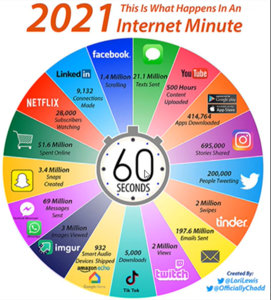

# Day 10

## Big Data
[Big Data](https://cloud.google.com/learn/what-is-big-data)

## PySpark - Apache
Used to deal with large volume of data 
[PySpark Apache](https://aws.amazon.com/what-is/apache-spark/)

## Architecture of Spark
[Architecture of Spark](https://medium.com/@amitjoshi7/spark-architecture-a-deep-dive-2480ef45f0be)

