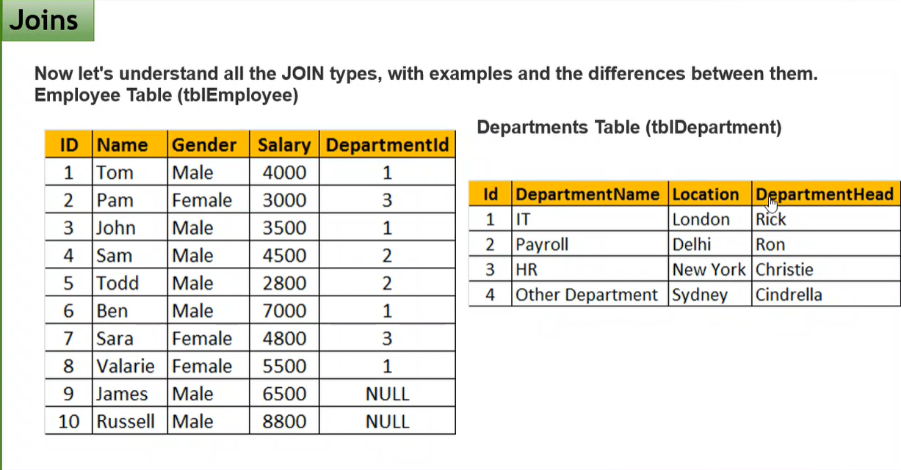
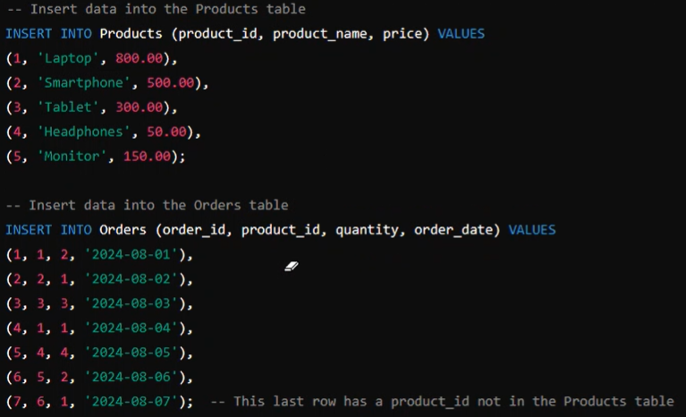

# Day 2

## Joins

Create these two tables for further queries
1. Create and use DB
~~~sql
create database CompanyDB

use CompanyDB
~~~

2. Create tables
~~~sql
CREATE TABLE tblEmployee
(ID int Primary Key,
Name nVarchar(100) not null,
Gender nVarchar(50),
Salary int not null,
DepartmentId int)

CREATE TABLE tblDepartment
(ID int Primary Key,
DepartmentName nVarchar(100) not null,
Location nVarchar(50) not null,
DepartmentHead nvarchar(100) not null)
~~~

3. Inserting values to tables
~~~sql
INSERT INTO tblEmployee(ID, Name, Gender, Salary, DepartmentId)
VALUES
(1, 'Tom', 'Male', 4000, 1),
(2, 'Pam' , 'Female', 3000, 3),
(3, 'John', 'Male', 3500, 1),
(4, 'Sam', 'Male', 4500, 2),
(5, 'Todd', 'Male', 2800, 2),
(6, 'Ben', 'Male', 7000, 1),
(7, 'Sara', 'Female', 4800, 3),
(8, 'Valarie', 'Female', 5500, 1),
(9, 'James', 'Male', 6500, null),
(10, 'Russell', 'Male', 8800, null)

INSERT INTO tblDepartment(ID, DepartmentName, Location, DepartmentHead)
VALUES
(1, 'IT', 'London', 'Rick'),
(2, 'Payroll', 'Delhi', 'Ron'),
(3, 'HR', 'New York', 'Christie'),
(4, 'Other Department', 'Sydney', 'Cindrella')
~~~

4. Display values of tables
~~~sql
select * from tblEmployee

select * from tblDepartment
~~~

### Inner Join
Selecting common values from both tables
Only when both records match it gives the entry as output
~~~sql
select Name, Gender, Salary, DepartmentName
from tblEmployee
INNER JOIN tblDepartment
ON tblEmployee.DepartmentId = tblDepartment.ID
~~~

### Left Outer Join OR Left Join
Returns the entries even if there is a null value 
~~~sql
select Name, Gender, Salary, DepartmentName
from tblEmployee
LEFT OUTER JOIN tblDepartment
ON tblEmployee.DepartmentId = tblDepartment.ID
~~~

### Right Outer Join
~~~sql
select Name, Gender, Salary, DepartmentName
from tblEmployee
RIGHT OUTER JOIN tblDepartment
ON tblEmployee.DepartmentId = tblDepartment.ID
~~~

### Full Outer Join
Give me matching and unmatching from left and right side 
~~~sql
select Name, Gender, Salary, DepartmentName
from tblEmployee
FULL OUTER JOIN tblDepartment
ON tblEmployee.DepartmentId = tblDepartment.ID
~~~

### Practice on Joins
Create tables with following data and perfrom all join queries  

1. Create Tables
~~~sql
CREATE TABLE Products
(product_id int Primary Key,
product_name nvarchar(50) not null,
price DECIMAL(6, 2))

CREATE TABLE Orders
(order_id int Primary Key,
product_id int,
quantity int,
order_date DATE)
~~~

2. Inserting values to tables
~~~sql
INSERT INTO Products(product_id, product_name, price)
VALUES
(1, 'Laptop', 800.00),
(2, 'Smartphone', 500.00),
(3, 'Tablet', 300.00),
(4, 'Headphones', 50.00),
(5, 'Monitor', 150.00)

INSERT INTO Orders(order_id, product_id, quantity, order_date)
VALUES
(1, 1, 2, '2024-08-01'),
(2, 2, 1, '2024-08-02'),
(3, 3, 3, '2024-08-03'),
(4, 1, 1, '2024-08-04'),
(5, 4, 4, '2024-08-05'),
(6, 5, 2, '2024-08-06'),
(7, 6, 1, '2024-08-07')
~~~

3.1. INNER JOIN
~~~sql
select product_name, price, quantity, order_date
from Orders
INNER JOIN Products
ON Orders.product_id = Products.product_id
~~~

3.2. LEFT OUTER JOIN
~~~sql
select product_name, price, quantity, order_date
from Orders
LEFT OUTER JOIN Products
ON Orders.product_id = Products.product_id
~~~

3.3. RIGHT OUTER JOIN
~~~sql
select product_name, price, quantity, order_date
from Orders
RIGHT OUTER JOIN Products
ON Orders.product_id = Products.product_id
~~~

3.4. FULL OUTER JOIN
~~~sql
select product_name, price, quantity, order_date
from Orders
FULL OUTER JOIN Products
ON Orders.product_id = Products.product_id
~~~

### Group by and Grouping sets
Group by used for grouping single column  
Grouping Sets is used for grouping multiple columns 
Example - 1
~~~sql
SELECT p.product_name, o.order_date, SUM(o.quantity) AS total_quantity
FROM Orders o
JOIN Products p ON o.product_id = p.product_id
GROUP BY GROUPING SETS ((p.product_name), (o.order_date))
~~~

Example - 2 
~~~sql
SELECT o.order_id, o.product_id,
	(SELECT p.product_name FROM Products p WHERE p.product_id = o.product_id) AS product_name
FROM Orders o
~~~