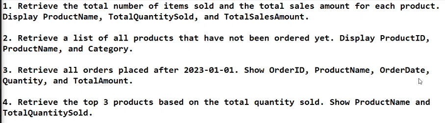
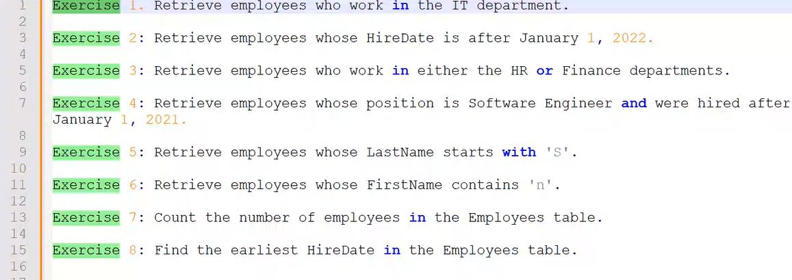
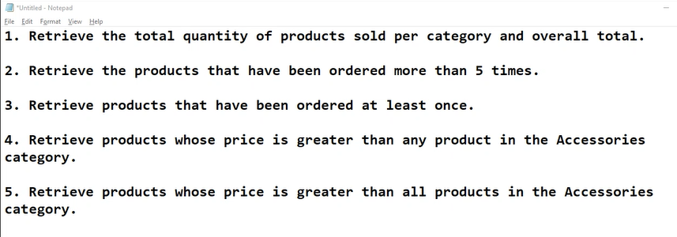

# Day 3

## Activity

1. 
~~~sql
select product_name AS ProductName,  SUM(quantity) AS TotalQuantitySold, SUM(price) AS TotalSalesAmount
from Products p
JOIN Orders o
ON p.product_id = o.product_id
GROUP BY p.product_name
~~~

2. 
~~~sql
SELECT p.product_id, p.product_name
FROM Products p
LEFT JOIN Orders o ON p.product_id = o.product_id
WHERE o.order_id IS NULL
~~~

3. 
~~~sql
SELECT o.order_id, p.product_name, o.order_date, o.quantity, p.price
FROM Orders o
INNER JOIN Products p ON o.product_id= p.product_id
WHERE o.order_date > '2023-01-01'
~~~

4. 
~~~sql
SELECT Top 3 p.product_name, SUM(o.quantity) AS TOtalQuantitySold
From orders o
INNER JOIN Products p ON o.product_id = p.product_id
GROUP BY p.product_name
ORDER BY TotalQuantitySold DESC
~~~

## Activity

1. 
~~~sql
select FirstName+' '+LastName AS Employee_Name from Employee
where Department LIKE 'IT%'
~~~

2. 
~~~sql
select FirstName+' '+LastName AS Employee_Name, HireDate from Employee
where HireDate > '2022-01-01'
~~~

3. 
~~~sql
select FirstName+' '+LastName AS Employee_Name, Department 
FROM Employee
WHERE Department LIKE 'HR' OR Department LIKE 'Finance'
~~~

4. 
~~~sql
select FirstName+' '+LastName AS Employee_Name, Position
from Employee
where Position LIKE 'Software Engineer' AND HireDate > '2021-01-01'
~~~

5. 
~~~sql
select FirstName+' '+LastName AS Employee_Name
from Employee
where LastName LIKE 'S%'
~~~

6. 
~~~sql
select FirstName+' '+LastName AS Employee_Name
from Employee
where FirstName LIKE '%n%'
~~~

7. 
~~~sql
select COUNT(*) AS Number_of_employees
from Employee
~~~

8. 
~~~sql
select MIN(HireDate) AS Minimum_HireDate
from Employee
~~~

### Multiple Clauses
~~~sql
SELECT DISTINCT p.product_name, p.price, o.order_date
FROM Products as p
INNER JOIN Orders AS o ON p.product_id = o.product_id
WHERE o.order_date > '2024-01-01'
AND p.price BETWEEN 5000 AND 50000
AND p.product_name LIKE 'S%'
~~~

### Pairing
~~~sql
SELECT p1.product_name AS Product1, p2.product_name AS Product2
FROM Products p1
INNER JOIN Products p2 ON p1.product_id <> p2.product_id
~~~

### HAVING clause
~~~sql
SELECT p.Category, SUM(o.Quantity) AS TotalQuantity
FROM Orders o
INNER JOIN Products p ON p.product_id = p.product_id
GROUP BY p.Category
HAVING SUM(o.Quantity) > 3
~~~

### Exercises

~~~sql

~~~

