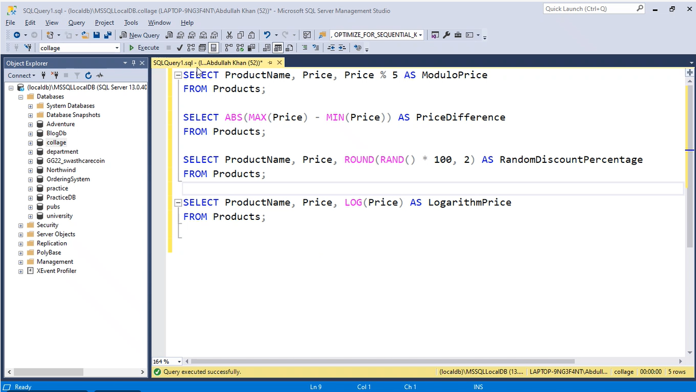
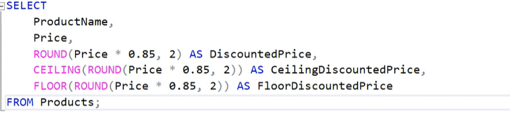
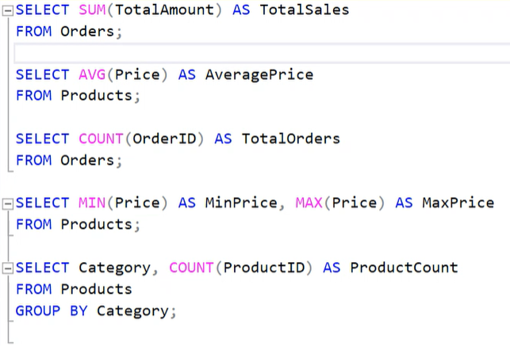
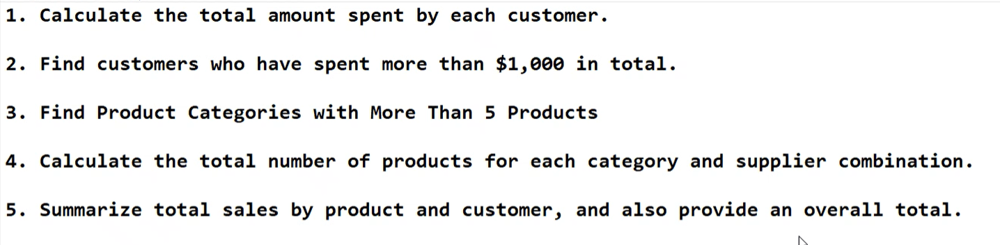
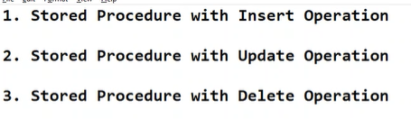

# Day 4

## Math Functions
First SS in phone

### Activity
1. Apply a 15% discount, round the discounted price to 2 decimal places, and show both the ceiling and floor values of the final discounted price.
Solution

## Exercise

1. 
~~~sql
SELECT ID, Name, SUM(PurchaseAmt) AS TotalAmountSpent
FROM Customer
GROUP BY ID, Name
~~~

2. 
~~~sql
SELECT ID, Name
FROM Customer
GROUP BY ID, Name
HAVING SUM(PurchaseAmt) > 1000
~~~

3. 
~~~sql
SELECT Category 
FROM Products 
GROUP BY Category
HAVING COUNT(*) > 5
~~~

4. 
~~~sql
SELECT CategoryID, SupplierID, COUNT(ProductID) AS TotalProducts
FROM Products
GROUP BY CategoryID, SupplierID
~~~

5. 
~~~sql
SELECT product_id, customer_id, SUM(Amount) AS TotalSales
FROM Products
GROUP BY product_id, customer_id
~~~

## Stored Procedures
Used because
1. It is secure - Because in a procedure we can hide the queries and execute only by Procedure name.
2. It is reusable
3. It is fast because when we create a procedure it gets stored in the cache and when we execute it, the procedure runs from the cache and hence it is fast
4. We can combine 2 or more queries in a stored procedure.
~~~sql
CREATE PROCEDURE GetAllProducts
AS
BEGIN
	SELECT * FROM Products;
END;

exec GetAllProducts
~~~ 

~~~sql
CREATE PROCEDURE GetAllProducts22
AS
BEGIN
	SELECT * FROM Products;
	SELECT * FROM Orders;
END;
~~~

### Procedure accepting parameters
1. Taking input in a stored procedure
~~~sql
CREATE PROCEDURE GetProductByID
	@ProductID INT
AS
BEGIN
	SELECT *
	FROM Products
	WHERE product_id = @ProductID
END;

EXEC GetProductByID @ProductID = 1;
~~~

2. Taking multiple inputs in a stored procedure
~~~sql
CREATE PROCEDURE GetProductByCategoryAndPrice
	@Category VARCHAR(50),
	@MinPrice DECIMAL(10, 2)
AS
BEGIN
	SELECT *
	FROM Products
	WHERE Category = @Category
	AND Price >= @MinPrice
END;

EXEC GetProductByCategoryAndPrice @Category = 'Electronics', @MinPrice = 500.00;
~~~

### Activity

1. 
~~~sql
CREATE PROCEDURE InsertByValue
	@ProductID INT,
	@ProductName VARCHAR(50),
	@Price DECIMAL(10, 2),
	@Category VARCHAR(50)
AS
BEGIN
	INSERT INTO Products(product_id, product_name, price, Category)
	VALUES
	(@ProductID, @ProductName, @Price, @Category);
END;

EXEC InsertByValue @ProductID = 11, @ProductName = 'Earphones', @Price = 300.00, @Category = 'Accessories';
~~~

2. 
~~~sql
CREATE PROCEDURE UpdateByValue
	@ProductID INT,
	@Price DECIMAL(10, 2)
AS
BEGIN
	UPDATE Products
	SET price = @Price
	WHERE product_id = @ProductID
END;

EXEC UpdateByValue @ProductID = 11, @Price = 400.00;
~~~

3. 
~~~sql
CREATE PROCEDURE DeleteByValue
	@ProductID INT
AS
BEGIN
	DELETE FROM Products WHERE
	product_id = @ProductID
END;

EXEC DeleteByValue @ProductID = 11;
~~~

