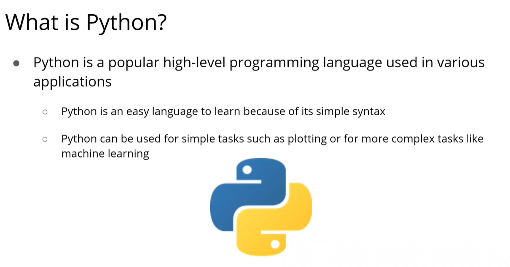
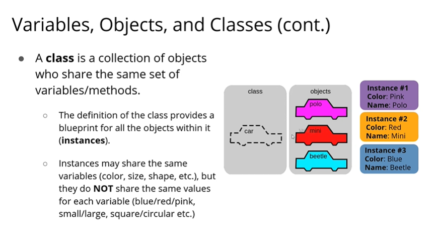
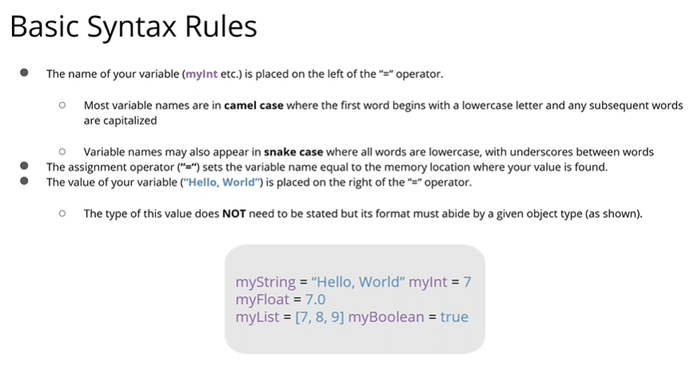
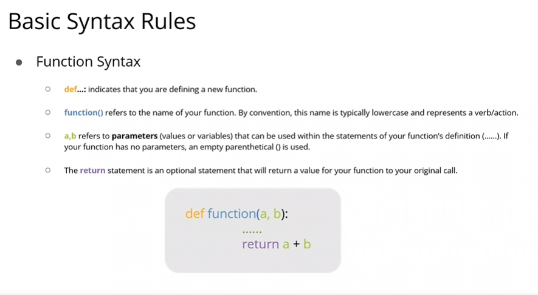

# Day 6

## PYTHON









### First Program
```python
print("Hello World")
```

### Printing String
1. Single quote and double quote are the same.
```python
single_quote_str = 'This is single quote String'
double_quote_str = "This is a double quote string"

print(single_quote_str)
print(double_quote_str)
```
2. We can use "double quote " inside single quotes to print the output.
```python
single_quote_str = 'This is single quote String - "Hey"'
double_quote_str = "This is a double quote string"

print(single_quote_str)
print(double_quote_str)
```
3. Double quotes inside double quotes is an error because now we are confusing python. 
```python
single_quote_str = "This is single quote String - "Hey""
double_quote_str = "This is a double quote string"

print(single_quote_str)
print(double_quote_str)
```

4. Multi-line String
```python
next_string = '''This is a 
Multiple line string
'''
print(next_string)
```

### Appending Strings
1. Using Concatenation
```python
greeting = "Hello"
name = "Alice"
full_greeting = greeting+", "+name+"!"
print(full_greeting)
```

2. Using format()
```python

greeting = "Hello"
name = "Alice"
formatted_greeting = "{}, {}".format(greeting, name)
print(formatted_greeting)
```

3. Using f-Strings
```python
formatted_greeting_f = f"{greeting}, {name}!"
print(formatted_greeting_f)
```

### Operations on String

1. __strip()__: Eliminates the space arond text
```python
text = "  Python Programming  "
stripped_text = text.strip()
print(stripped_text)
```

2. __upper()__: Converts text to uppercase
```python
uppercase_text = text.upper()
print(uppercase_text)
```

3. __startswith()__: Checks whether the string text starts with the subtring text.
```python
starts_with_python = text.startswith("Python")
print(starts_with_python)
```
States false because there is some space in text

After removing spaces using strip()
```python
formatted_text = text.strip()
starts_with_python = formatted_text.startswith("Python")
print(starts_with_python)
```
4. __replace()__: Replaces the given substring with mentioned substring in the main string text
```python
replaced_text = text.replace("Programming", "Coding")
print(replaced_text)
```

### Integers
Can be positive, negative or neutral
```python
positive_int = 42
negative_int = -42
zero = 0

print(positive_int)
print(negative_int)
print(zero)
```

### Operations on Numbers
```python
a = 10
b = 3

# Addition
addition = a+b

# Subtraction
subtraction = a-b

# Multiplication
multiplication = a*b

# Division
division = a/b

# Floor Division
floor_division = a//b

# Modulus
modulus = a%b

# Exponentiation
exponentiation = a**b

print("Addition: ",addition)
print("Subtraction: ",subtraction)
print("Multiplication: ", multiplication)
print("Division: ",division)
print("Floor Division: ",floor_division)
print("Modulus: ", modulus)
print("Exponentiation: ",exponentiation)
```

#### Type casting
1. String to integer using __int()__
```python
num_str = "100"
num_int = int(num_str)

print("String to Integer: ", num_int)
```
2. Convert float to integer using __int()__
```python
num_float = 12.34
num_int_from_float = int(num_float)

print("Float to Integer: ", num_int_from_float)
```

3. Converting different data types to boolean
```python
# Convert integer to boolean
bool_from_int = bool(1) # True

# Convert zero to boolean
bool_from_zero = bool(0) # False

# Convert string to boolean
bool_from_str = bool("Hello") # True

# Convert empty string to boolean
bool_from_empty_str = bool("") # False

print("Boolean from integer 1: ",bool_from_int)
print("Boolean from integer 0: ",bool_from_zero)
print("Boolean from non-empty string: ",bool_from_str)
print("Boolean from empty string: ",bool_from_empty_str)
```

### Comparison Operator
```python
x = 10
y = 5
is_greater = x > y # True
is_equal = x == y # False
print("x >y",is_greater)
print("x == y", is_equal)
```

### Logical Operator
```python
a = True
b = False
#Logical AND
and_operation = a and b # a * b -- True * False -- 1 * 0 - False

# Logical OR
or_operation = a or b # True + False -- True -- 1

# Logical NOT
not_operation = not a # False

print("a AND b: ",and_operation)
print("a OR b: ",or_operation)
print("NOT a: ",not_operation)
```
