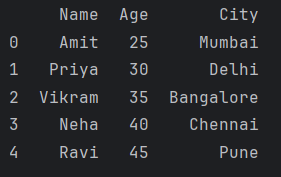

# Day 8

## APIs - Application Programming Interface
A project we work on will have 3 layers:
1. UI Layer
2. API Layer
3. Database

API layer returns a JSON file because JSON is cross-platform. 

Examples of API: 
1. Cricket Score
2. Stock market

### Methods of APIs
1. __get()__: used to request data from a server. The data is typically in the form of a file or a web page.<br>
__.json()__: This method attempts to decode the response content into a Python dictionary. Since the requests library automatically detects JSON data, it uses the appropriate decoder.

```python
import requests

response = requests.get("https://dummyjson.com/products/1")
print(response.json()) # Print the HTTP status code
```

### DataFrames
pandas allows us to convert data to dataframes using DataFrames class.<br>
Improves data viewing by converting dictionary to dataframes.
```python
import pandas as pd

# Creating a DataFrame from a dictionary with Indian names
data = {
    "Name":["Amit", "Priya", "Vikram", "Neha", "Ravi"],
    "Age": [25, 30, 35, 40, 45],
    "City": ["Mumbai", "Delhi", "Bangalore", "Chennai", "Pune"]
}

df = pd.DataFrame(data)
print(df)
```
Output:


#### Accessing data from DataFrames
```python
import pandas as pd

# Creating a DataFrame from a dictionary with Indian names
data = {
    "Name":["Amit", "Priya", "Vikram", "Neha", "Ravi"],
    "Age": [25, 30, 35, 40, 45],
    "City": ["Mumbai", "Delhi", "Bangalore", "Chennai", "Pune"]
}

df = pd.DataFrame(data)
# print(df)

# Accessing a single column
print("Names: ",df["Name"])

# Accessing multiple columns
print(df[["Name", "Age"]])

# Accessing rows using index
print(df.iloc[0]) # First row

# Accessing multiple rows using index
print(df.iloc[:3])
```
`iloc` stands for "integer location".

We use `dataframe_name.iloc[index_number]` to access rows using index for DataFrames.

#### Filtering Data
Using DataFrames it is easy to filter data.
```python
import pandas as pd

# Creating a DataFrame from a dictionary with Indian names
data = {
    "Name":["Amit", "Priya", "Vikram", "Neha", "Ravi"],
    "Age": [25, 30, 35, 40, 45],
    "City": ["Mumbai", "Delhi", "Bangalore", "Chennai", "Pune"]
}

df = pd.DataFrame(data)
print(df)

# Filter rows where Age is greater than 30
filtered_df = df[df["Age"] > 30]
print(filtered_df)
```


