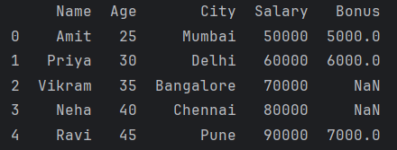

# Day 8

## APIs - Application Programming Interface
A project we work on will have 3 layers:
1. UI Layer
2. API Layer
3. Database

API layer returns a JSON file because JSON is cross-platform. 

Examples of API: 
1. Cricket Score
2. Stock market

### Methods of APIs
1. __get()__: used to request data from a server. The data is typically in the form of a file or a web page.<br>
__.json()__: This method attempts to decode the response content into a Python dictionary. Since the requests library automatically detects JSON data, it uses the appropriate decoder.

```python
import requests

response = requests.get("https://dummyjson.com/products/1")
print(response.json()) # Print the HTTP status code
```

## DataFrames
pandas allows us to convert data to dataframes using DataFrames class.<br>
Improves data viewing by converting dictionary to dataframes.
```python
import pandas as pd

# Creating a DataFrame from a dictionary with Indian names
data = {
    "Name":["Amit", "Priya", "Vikram", "Neha", "Ravi"],
    "Age": [25, 30, 35, 40, 45],
    "City": ["Mumbai", "Delhi", "Bangalore", "Chennai", "Pune"]
}

df = pd.DataFrame(data)
print(df)
```
Output:


### Accessing data from DataFrames
```python
import pandas as pd

# Creating a DataFrame from a dictionary with Indian names
data = {
    "Name":["Amit", "Priya", "Vikram", "Neha", "Ravi"],
    "Age": [25, 30, 35, 40, 45],
    "City": ["Mumbai", "Delhi", "Bangalore", "Chennai", "Pune"]
}

df = pd.DataFrame(data)
# print(df)

# Accessing a single column
print("Names: ",df["Name"])

# Accessing multiple columns
print(df[["Name", "Age"]])

# Accessing rows using index
print(df.iloc[0]) # First row

# Accessing multiple rows using index
print(df.iloc[:3])
```
`iloc` stands for "integer location".

We use `dataframe_name.iloc[index_number]` to access rows using index for DataFrames.

### Filtering Data
Using DataFrames it is easy to filter data.
```python
import pandas as pd

# Creating a DataFrame from a dictionary with Indian names
data = {
    "Name":["Amit", "Priya", "Vikram", "Neha", "Ravi"],
    "Age": [25, 30, 35, 40, 45],
    "City": ["Mumbai", "Delhi", "Bangalore", "Chennai", "Pune"]
}

df = pd.DataFrame(data)
print(df)

# Filter rows where Age is greater than 30
filtered_df = df[df["Age"] > 30]
print(filtered_df)
```

### Adding a new column to the DataFrame
```python
import pandas as pd

# Creating a DataFrame from a dictionary with Indian names
data = {
    "Name":["Amit", "Priya", "Vikram", "Neha", "Ravi"],
    "Age": [25, 30, 35, 40, 45],
    "City": ["Mumbai", "Delhi", "Bangalore", "Chennai", "Pune"]
}

df = pd.DataFrame(data)

# Adding a new column 'Salary'
df["Salary"] = [50000, 60000, 70000, 80000, 90000]
print(df)
```

### Sorting values in a DataFrame
```python
import pandas as pd

# Creating a DataFrame from a dictionary with Indian names
data = {
    "Name":["Amit", "Priya", "Vikram", "Neha", "Ravi"],
    "Age": [25, 30, 35, 40, 45],
    "City": ["Mumbai", "Delhi", "Bangalore", "Chennai", "Pune"]
}

df = pd.DataFrame(data)

# Sorting by Age
sorted_df = df.sort_values(by="Age", ascending=False)
print(sorted_df)
```

### Renaming columns
```python
import pandas as pd

# Creating a DataFrame from a dictionary with Indian names
data = {
    "Name":["Amit", "Priya", "Vikram", "Neha", "Ravi"],
    "Age": [25, 30, 35, 40, 45],
    "City": ["Mumbai", "Delhi", "Bangalore", "Chennai", "Pune"]
}

df = pd.DataFrame(data)

# Rename the 'Name' column to 'Full Name' and 'Age' to 'Years'
df_renamed = df.rename(columns={"Name": "Full Name", "Age": "Years"})
print(df_renamed)
```

### Dropping columns
```python
import pandas as pd

# Creating a DataFrame from a dictionary with Indian names
data = {
    "Name":["Amit", "Priya", "Vikram", "Neha", "Ravi"],
    "Age": [25, 30, 35, 40, 45],
    "City": ["Mumbai", "Delhi", "Bangalore", "Chennai", "Pune"]
}

df = pd.DataFrame(data)

# Drop the 'City' column
df_dropped = df.drop(columns=["City"])
print(df_dropped)
```

### Dropping rows by index
```python
import pandas as pd

# Creating a DataFrame from a dictionary with Indian names
data = {
    "Name":["Amit", "Priya", "Vikram", "Neha", "Ravi"],
    "Age": [25, 30, 35, 40, 45],
    "City": ["Mumbai", "Delhi", "Bangalore", "Chennai", "Pune"]
}

df = pd.DataFrame(data)

# Drop the row at index 2 (Vikram)
df_dropped_row = df.drop(index=2)
print(df_dropped_row)
```

### Giving meaning to the DataFrame 
__apply()__: The `apply` method is used to apply a function to each element of the "Age" column.
```python
import pandas as pd

# Creating a DataFrame from a dictionary with Indian names
data = {
    "Name":["Amit", "Priya", "Vikram", "Neha", "Ravi"],
    "Age": [25, 30, 35, 40, 45],
    "City": ["Mumbai", "Delhi", "Bangalore", "Chennai", "Pune"]
}

df = pd.DataFrame(data)

# Create a new column 'Seniority' based on the Age
df['Seniority'] = df['Age'].apply(lambda x: 'Senior' if x >= 35 else 'Junior')
print(df)
```

### Grouping columns
```python
import pandas as pd

# Creating a DataFrame from a dictionary with Indian names
data = {
    "Name":["Amit", "Priya", "Vikram", "Neha", "Ravi"],
    "Age": [25, 30, 35, 40, 45],
    "City": ["Mumbai", "Delhi", "Bangalore", "Chennai", "Pune"]
}

df = pd.DataFrame(data)

# Adding a new column 'Salary'
df['Salary'] = [50000, 60000, 70000, 80000, 90000]

# Group by 'City' and calculate the average Salary in each city
df_grouped = df.groupby("City")["Salary"].mean()
print(df_grouped)
```

Selects the "Salary" column from the grouped DataFrame.<br>
Calculates the mean (average) value of the "Salary" column for each group (city). 👇
```python
df_grouped = df.groupby("City")["Salary"].mean()
```

### Adding a particular value to columns
```python
import pandas as pd

# Creating a DataFrame from a dictionary with Indian names
data = {
    "Name":["Amit", "Priya", "Vikram", "Neha", "Ravi"],
    "Age": [25, 30, 35, 40, 45],
    "City": ["Mumbai", "Delhi", "Bangalore", "Chennai", "Pune"]
}

df = pd.DataFrame(data)

# Adding a new column 'Salary'
df['Salary'] = [50000, 60000, 70000, 80000, 90000]

# Apply a custom function to the 'Salary' column to add a 10% bonus
def add_bonus(salary):
    return salary*1.10

df['Salary_with_Bonus'] = df['Salary'].apply(add_bonus)
print(df)
```

Uses the apply method to apply the add_bonus function to each element of the "Salary" column. 👇
```python
df['Salary_with_Bonus'] = df['Salary'].apply(add_bonus)
```

### Merging DataFrames
```python
import pandas as pd

# Creating a DataFrame from a dictionary with Indian names
data = {
    "Name":["Amit", "Priya", "Vikram", "Neha", "Ravi"],
    "Age": [25, 30, 35, 40, 45],
    "City": ["Mumbai", "Delhi", "Bangalore", "Chennai", "Pune"]
}

df = pd.DataFrame(data)

# Adding a new column 'Salary'
df['Salary'] = [50000, 60000, 70000, 80000, 90000]

df_new = pd.DataFrame({
    "Name": ["Amit", "Priya", "Ravi"],
    "Bonus": [5000, 6000, 7000]
})

# Merge based on the 'Name' column - it's kind of a left join
df_merged = pd.merge(df, df_new, on="Name", how="left")
print(df_merged)
```
Output:


The table has null values because in the new DataFrame there are no values present for the `Name` : `Vikram` and `Neha`

### Concatenate DataFrames
When we need to concatenate the data shoud be exactly of the same structure.
```python
import pandas as pd

# Creating a DataFrame from a dictionary with Indian names
data = {
    "Name":["Amit", "Priya", "Vikram", "Neha", "Ravi"],
    "Age": [25, 30, 35, 40, 45],
    "City": ["Mumbai", "Delhi", "Bangalore", "Chennai", "Pune"]
}

df = pd.DataFrame(data)

# Adding a new column 'Salary'
df['Salary'] = [50000, 60000, 70000, 80000, 90000]

df_new = pd.DataFrame({
    "Name": ["Sonia", "Rahul"],
    "Age": [29, 31],
    "City": ["Kolkata", "Hyderabad"],
    "Salary": [58000, 63000]
})

# Concatenate the two DataFrames
df_concat = pd.concat([df, df_new], ignore_index=True)
print(df_concat)
```

Using `ignore_index` we are saying to the compiler that ignore the index and give me the DataFrame perfectly.


### Exercises
1. Filter records with Salary > 50000
```python
import pandas as pd

# Creating a DataFrame from a dictionary with Indian names
data = {
    "Name":["Amit", "Priya", "Vikram", "Neha", "Ravi"],
    "Age": [25, 30, 35, 40, 45],
    "City": ["Mumbai", "Delhi", "Bangalore", "Chennai", "Pune"]
}

df = pd.DataFrame(data)

# Adding a new column 'Salary'
df['Salary'] = [50000, 60000, 70000, 80000, 90000]

filtered_df = df[df["Salary"] > 50000]
print(filtered_df)
```

2. Filter records whose name starts with A
```python
import pandas as pd

# Creating a DataFrame from a dictionary with Indian names
data = {
    "Name":["Amit", "Priya", "Vikram", "Neha", "Ravi"],
    "Age": [25, 30, 35, 40, 45],
    "City": ["Mumbai", "Delhi", "Bangalore", "Chennai", "Pune"]
}

df = pd.DataFrame(data)

# Adding a new column 'Salary'
df['Salary'] = [50000, 60000, 70000, 80000, 90000]

filtered_df = df[df["Name"].str.startswith('A')]
print(filtered_df)
```

### Hands-on DataFrames
```python
import pandas as pd

# Creating a new dataset
data = {
    "Employee_ID": [101, 102, 103, 104, 105, 106],
    "Name": ["Rajesh", "Meena", "Suresh", "Anita", "Vijay", "Neeta"],
    "Department": ["HR", "IT", "Finance", "IT", "Finance", "HR"],
    "Age": [29, 35, 45, 32, 50, 28],
    "Salary": [70000, 85000, 95000, 64000, 120000, 72000],
    "City": ["Delhi", "Mumbai", "Bangalore", "Chennai", "Delhi", "Mumbai"]
}

df = pd.DataFrame(data)
print(df)
```

1. Rename Columns
    1. Rename the "Salary" column to "Annual Salary" and "City" to "Location".
    2. Print the updated DataFrame.
```python
df_rename = df.rename(columns={"Salary": "Annual Salary", "City": "Location"})
print(df_rename)
```

2. Drop Columns
    1. Drop the "Location" column from the DataFrame.
    2. Print the DataFrame after dropping the column.
```python
df_dropped = df.drop(columns=["City"])
print(df_dropped)
```

3. Drop Rows
    1. Drop the row where "Name" is "Suresh".
    2. Print the updated DataFrame.
```python
df_dropped_row = df.drop(index=2)
print(df_dropped_row)
```

4. Handle Missing Data
    1. Assign None to the "Salary" of "Meena".
    2. Fill the missing "Salary" value with the mean salary of the existing employees.
    3. Print the cleaned DataFrame.
```python
df_updated = df
df_updated["Salary"][1] = None

mean_salary = df_updated["Salary"].mean()
df_updated["Salary"] = df_updated["Salary"].fillna(mean_salary)
print(df_updated)
```
`df_updated["Salary"] = df_updated["Salary"].fillna(mean_salary)` replaces the None value with the calculated mean value, effectively filling the missing data.

5. Create Conditional Columns
    1. Create a new column "Seniority" that assigns "Senior" to employees aged 40 or above and "Junior" to employees younger than 40.
    2. Print the updated DataFrame.
```python
df['Seniority'] = df['Age'].apply(lambda x: 'Senior' if x>= 40 else 'Junior')
print(df)
```

6. Grouping and Aggregation
    1. Group the DataFrame by "Department" and calculate the average salary in each department.
    2. Print the grouped DataFrame.
```python
df_grouped = df.groupby("Department")["Salary"].mean()
print(df_grouped)
```

### CSV to DataFrame
Create CSV file employees.csv and convert it into DataFrames.<br>
CSV file data:
```
Employee_ID,Name,Department,Age,Salary,City
101,Rajesh,HR,29,70000,Delhi
102,Meena,IT,35,85000,Mumbai
103,Suresh,Finance,45,95000,Bangalore
104,Anita,IT,32,64000,Chennai
105,Vijay,Finance,50,120000,Delhi
106,Neeta,HR,28,72000,Mumbai
```

```python
import csv
import pandas as pd

file_name = "D:/PythonCode/pythonProject/employees.csv"

# Writing data to CSV file
data = [["Employee_ID","Name","Department","Age","Salary","City"],
        [101,"Rajesh","HR",29,70000,"Delhi"],
        [102,"Meena","IT",35,85000,"Mumbai"],
        [103,"Suresh","Finance",45,95000,"Bangalore"],
        [104,"Anita","IT",32,64000,"Chennai"],
        [105,"Vijay","Finance",50,120000,"Delhi"],
        [106,"Neeta","HR",28,72000,"Mumbai"]]
with open(file_name, "w", newline="") as file:
    writer = csv.writer(file)
    writer.writerows(data)

# Load the CSV file into a data frame
df = pd.read_csv(file_name)
print(df)
```

1. Displaying first n number of rows, summary information and summary statistics of given data
```python
# Display the first three rows
print(df.head(3))

# Show summary information about DataFrame
print(df.info())

# Display summary statistics of numeric columns
print(df.describe())
```

2. Sorting and Filtering rows
```python
import csv
import pandas as pd

file_name = "D:/PythonCode/pythonProject/employees.csv"

# Writing data to CSV file
data = [["Employee_ID","Name","Department","Age","Salary","City"],
        [101,"Rajesh","HR",29,70000,"Delhi"],
        [102,"Meena","IT",35,85000,"Mumbai"],
        [103,"Suresh","Finance",45,95000,"Bangalore"],
        [104,"Anita","IT",32,64000,"Chennai"],
        [105,"Vijay","Finance",50,120000,"Delhi"],
        [106,"Neeta","HR",28,72000,"Mumbai"]]
with open(file_name, "w", newline="") as file:
    writer = csv.writer(file)
    writer.writerows(data)

# Load the CSV file into a data frame
df = pd.read_csv(file_name)
# print(df)

# Filter rows where Salary is greater than 80000
high_salary_df = df[df["Salary"] > 80000]
print(high_salary_df)

# Sort by Age in descending order
sorted_df = df.sort_values(by="Age", ascending=False)
print(sorted_df)
```

### JSON to DataFrame
```python
import json

import pandas as pd

file_name = "D:/PythonCode/pythonProject/employees.json"

data = [
    {"Employee_ID": 101, "Name": "Rajesh", "Department": "HR", "Age": 29, "Salary": 70000, "City": "Delhi"},
    {"Employee_ID": 102, "Name": "Meena", "Department": "IT", "Age": 35, "Salary": 85000, "City": "Mumbai"},
    {"Employee_ID": 103, "Name": "Suresh", "Department": "Finance", "Age": 45, "Salary": 95000, "City": "Bangalore"},
    {"Employee_ID": 104, "Name": "Anita", "Department": "IT", "Age": 32, "Salary": 64000, "City": "Chennai"},
    {"Employee_ID": 105, "Name": "Vijay", "Department": "Finance", "Age": 50, "Salary": 120000, "City": "Delhi"},
    {"Employee_ID": 106, "Name": "Neeta", "Department": "HR", "Age": 28, "Salary": 72000, "City": "Mumbai"}
]
with open(file_name, "w") as file:
    json.dump(data, file)

# Load the JSON file into a DataFrame
df = pd.read_json('employees.json')

# Print the DataFrame
print(df)
```

### DataFrame to JSON
```python
import json

import pandas as pd

file_name = "D:/PythonCode/pythonProject/employees.json"

data = [
    {"Employee_ID": 101, "Name": "Rajesh", "Department": "HR", "Age": 29, "Salary": 70000, "City": "Delhi"},
    {"Employee_ID": 102, "Name": "Meena", "Department": "IT", "Age": 35, "Salary": 85000, "City": "Mumbai"},
    {"Employee_ID": 103, "Name": "Suresh", "Department": "Finance", "Age": 45, "Salary": 95000, "City": "Bangalore"},
    {"Employee_ID": 104, "Name": "Anita", "Department": "IT", "Age": 32, "Salary": 64000, "City": "Chennai"},
    {"Employee_ID": 105, "Name": "Vijay", "Department": "Finance", "Age": 50, "Salary": 120000, "City": "Delhi"},
    {"Employee_ID": 106, "Name": "Neeta", "Department": "HR", "Age": 28, "Salary": 72000, "City": "Mumbai"}
]
with open(file_name, "w") as file:
    json.dump(data, file)

# Load the JSON file into a DataFrame
df = pd.read_json('employees.json')

# Print the DataFrame
print(df)

# Add a new column 'Bonus' which is 10% of the Salary
df['Bonus'] = df['Salary'] * 0.10
print(df)

# Save the updated DataFrame to a new JSON file
df.to_json('employees_with_bonus.json', orient='records', lines=True)
```
