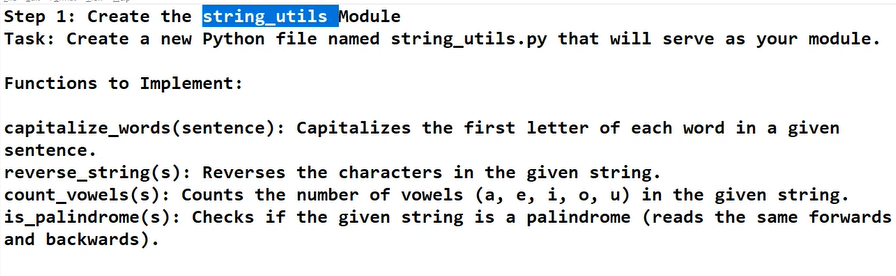

# Day 9

## Hands-on : DataFrames

### **Exercise 5: Handling Missing Values**
1. Create a DataFrame with missing values:
   ```python
   data = {
       "Name": ["Amit", "Neha", "Raj", "Priya"],
       "Age": [28, None, 35, 29],
       "City": ["Delhi", "Mumbai", None, "Chennai"]
   }
   df = pd.DataFrame(data)
   ```
2. Fill missing values in the `"Age"` column with the average age.
3. Drop rows where any column has missing data.
```python
data = {
    "Name": ["Amit", "Neha", "Raj", "Priya"],
    "Age": [28, None, 35, 29],
    "City": ["Delhi", "Mumbai", None, "Chennai"]
}
df = pd.DataFrame(data)

average_age = df['Age'].mean()
df['Age'] = df['Age'].fillna(average_age)

df_dropped = df.dropna()

print(df_dropped)
```

### **Exercise 6: Adding and Removing Columns**
1. Add a new column `"Salary"` with the following values: `[50000, 60000, 70000, 65000]`.
2. Remove the `"City"` column from the DataFrame.
```python
df['Salary'] = [50000, 60000, 70000, 65000]

df_dropped_2 = df.drop(columns=["City"])

print(df)
print(df_dropped_2)
```

### **Exercise 7: Sorting Data**
1. Sort the DataFrame by `"Age"` in ascending order.
2. Sort the DataFrame first by `"City"` and then by `"Age"` in descending order.
```python
df_sorted = df.sort_values(by='Age', ascending=True)
print(df_sorted)

df_sorted_city = df.sort_values(by='City', ascending=True)
df_sorted_city_age = df.sort_values(by='Age', ascending=False)
print(df_sorted_city_age)
```

### **Exercise 8: Grouping and Aggregation**
1. Group the DataFrame by `"City"` and calculate the average `"Age"` for each city.
2. Group the DataFrame by `"City"` and `"Age"`, and count the number of occurrences for each group.
```python
df_grouped_1 = df.groupby("City")["Age"].mean()
print(df_grouped_1)

df_grouped_2 = df.groupby(["City", "Age"]).size().reset_index(name='Count')
print(df_grouped_2)
```

### **Exercise 9: Merging DataFrames**
1. Create two DataFrames:A
   ```python
   df1 = pd.DataFrame({
       "Name": ["Amit", "Neha", "Raj"],
       "Department": ["HR", "IT", "Finance"]
   })

   df2 = pd.DataFrame({
       "Name": ["Neha", "Raj", "Priya"],
       "Salary": [60000, 70000, 65000]
   })
   ```
2. Merge `df1` and `df2` on the `"Name"` column using an inner join.
3. Merge the same DataFrames using a left join.
```python
df1 = pd.DataFrame({
       "Name": ["Amit", "Neha", "Raj"],
       "Department": ["HR", "IT", "Finance"]
   })

df2 = pd.DataFrame({
       "Name": ["Neha", "Raj", "Priya"],
       "Salary": [60000, 70000, 65000]
})

merged_df_inner = pd.merge(df1, df2, on="Name", how="inner")
merged_df_left = pd.merge(df1, df2, on="Name", how="left")

print("Inner Join:\n",merged_df_inner)
print("\nLeft Join:",merged_df_left)
```

## Modules in Python
Group of reusable functions
1. 
FileName: `mymodule.py`
```python
def greet(name):
    return f"Hello, {name}!"
```

FileName: `main.py`
```python
import mymodule

print(mymodule.greet("Sanjana"))
```

2. 
FileName: `math_operations.py`
```python
def add(a, b):
    return a + b

def subtract(a, b):
    return a-b

def multiply(a, b):
    return a*b

def divide(a, b):
    return a/b
```

FileName: `main.py`
```python
import math_operations

a = 20
b = 10

print("Add: ",math_operations.add(a, b))
print("Subtract: ",math_operations.subtract(a, b))
print("Multiply: ",math_operations.multiply(a, b))
print("Division: ",math_operations.divide(a, b))
```
3. 

Filename: `string_utils.py`
```python
def capitalize_words(str):
    words = str.split()
    capitalize_words = [word.capitalize() for word in words]
    return " ".join(capitalize_words)

def reverse_string(str):
    return str[::-1]

def count_vowels(str):
    vowels = "aeiouAEIOU"
    count = 0

    for char in str:
        if char in vowels:
            count+=1

    return count

def is_palindrome(str):
    cleaned_str = ''.join(c.lower() for c in str if c.isalnum())

    reversed_str = cleaned_str[::-1]

    if cleaned_str == reversed_str:
        return True
    else:
        return False
```

Filename: `main.py`
```python
import string_utils
from string_utils import capitalize_words

capitalize = string_utils.capitalize_words("hello, I am Sanjana")
print("Capitalized words string: ",capitalize_words)

reverse = string_utils.reverse_string("Hello I am Somesh")
print("Reversed String",reverse)

count = string_utils.count_vowels("Count vowels, please")
print("Number of vowels: ",count)

palindrome = string_utils.is_palindrome("Malayalam")
print("The string is palindrome?: ",palindrome)
```

4. 
`mymodule_one.py` 
```python
def greet(name):
    return f"Hello, {name}!"

# Code to execute when the module is run as a script
if __name__ == "__main__":
    # This block will only run if this file is executed directly
    print("Executing mymodule as a script.")
    name = "World"
    print(greet(name))
```

`main.py`
```python
import mymodule_one

print(mymodule_one.greet("Sanjana"))
```

5. 
Package: `mypackage`
Filename: `arithmetic.py`
```python
def add(a, b):
    return a + b

def subtract(a, b):
    return a-b

def multiply(a, b):
    return a*b

def divide(a, b):
    if b==0:
        return "Cannot divide by 0"

    else:
        return a/b
```

Filename: `geometry.py`
```python
import math

def area_of_circle(radius):
    return math.pi * (radius ** 2)

def perimeter_of_circle(radius):
    return 2 * math.pi * radius

def area_of_rectangle(length, breadth):
    return length * breadth

def perimeter_of_rectangle(length, breadth):
    return 2 * (length + breadth)
```

Filename: `__init__.py`
```python
__all__ = ["arithmetic", "geometry"]
```

Filename: `main.py`
```python
# Importing the arithmetic module from mypackage
from mypackage import arithmetic

# Importing the geometry module from mypackage
from mypackage import geometry

# importing everything
from mypackage import *

# Using functions from arithmetic module
print("Addition: ",arithmetic.add(10, 5))
print("Division: ",arithmetic.divide(10, 2))

# Using functions from geometry module
print("Area of circle: ",geometry.area_of_circle(5))
print("Perimeter of Rectangle: ",geometry.perimeter_of_rectangle(10, 5))
```


To import a file from the same package in which it is present.
```python
from . import arithmetic
```

## Types of arguments

1. Keyword Arguments
```python
def describe_pet(pet_name, animal_type="dog"):
    print(f"I have a {animal_type} named {pet_name}.")

# Using keyword arguments
describe_pet(animal_type="cat", pet_name="Whiskers")
describe_pet(pet_name="Rover")
```

2. Arbitrary Arguments for String
```python
def make_pizza(size, *toppings):
    print(f"Making a {size}-inch pizza with  the following toppings: ")
    for topping in toppings:
        print(f"-{topping}")

# Calling with arbitrary positional arguments
make_pizza(12, "pepperoni", "mushrooms", "green peppers")
```

3. Arbitrary Keyword Arguments for dictionaries
```python
def build_profile(first, last, **user_info):
    return {"first_name": first, "last_name": last, **user_info}

# Calling with arbitrary keyword arguments
user_profile = build_profile("John", "Doe", location="New York", field="Engineering")
print(user_profile)
```


## Data Processing
### Using numpy
#### Creating a 1-D array
```python
import numpy as np

# Create a one-dimensional array
arr = np.array([1, 2, 3, 4, 5])
print("Array: ", arr)
```
#### Reshape to a 2x3 array
```python
reshaped_arr = np.arange(6).reshape(2, 3)
print("Reshaped Array: ",reshaped_arr)
```
#### Element-wise addition
```python
arr_add = arr+10
print("Added 10 to each element: ", arr_add)
```
#### Element-wise multiplication
```python
arr_mul = arr*2
print("Multiplied each element by 2: ",arr_mul)
```

#### Slicing arrays
```python
sliced_arr = arr[1:4] # Get elements from index 1 to 3
print("Sliced Array: ",sliced_arr)
```

## Data Cleaning
### Reading the CSV File
```csv
Name, Age, City, Salary
John Doe, 29, New York, 75000
Jane Smith, 34, Los Angeles, 82000
Sam Brown, 22, , 54000
Emily Davis, , Chicago, 91000
Michael Johnson, 45, Houston,
Anna Lee, 30, San Francisco, 77000
```

```python
import pandas as pd

# Load the CSV file
df = pd.read_csv('sample_data.csv')

# Display the DataFrame
print(df)
```

#### Display rows with missing data
```python
print(df[df.isnull().any(axis=1)])
```

#### Check for missing values in each column
```python
print(df.isnull().sum())
```

#### Replace empty strings with only spaces with NaN
```python
df.replace(r'^\s*$', np.nan, regex=True, inplace=True)
```

#### dropna()

#### fillna()
```python
import pandas as pd
import numpy as np

# Load the CSV file
df = pd.read_csv('sample_data.csv')

print("Before Transformation")
# Display the DataFrame
print(df)

# Ensure there are no leading/trailing spaces in column names
df.columns = df.columns.str.strip()

# Strip spaces from the city column and replace empty string NaN
df['City'] = df['City'].str.strip().replace('',np.nan)

# Fill missing values in the 'City' column with 'Unknown'
df['City'] = df['City'].fillna('Unknown')

# Fill missing values in the 'Age' column with the median age
df['Age'] = pd.to_numeric(df['Age'].str.strip(), errors='coerce')
df['Age'] = df['Age'].fillna(df['Age'].median())

# Fill missing values in the 'Salary' column with the median salary
df['Salary'] = df['Salary'].fillna(df['Salary'].median())

# Display the DataFrame after filling missing values
print(df)
```