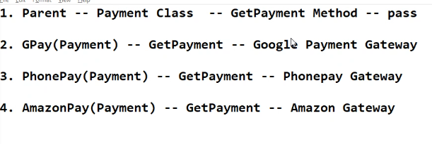

# Day 7

## Hands-on Exercise - Dictionary
1. Create a Dictionary<br>
    1. Create a dictionary called `person` with the following key-value pairs:
   - Name: "Alice"
   - Age: 25
   - City: "New York"<br>
    2. Print the dictionary.
```python
person = {
   "Name": "Alice",
   "Age": 25,
   "City": "New York"
}
print(person)
```

2. Access Dictionary Elements
Access the value of the `"City"` key and print it.
```python
city = person[("City")]
print(city)
```

3. Add and Modify Elements
    1. Add a new key-value pair to the `person` dictionary: `"email": "alice@example.com"`.
    2. Change the value of the `"Age"` key to 26.
    3. Print the modified dictionary.
```python
person["email"] = "alice@example.com"
person["Age"] = 26
print(person)
```

4. Remove Elements
    1. Remove the `"City"` key from the `person` dictionary.
    2. Print the dictionary after removing the key.
```python
del person["City"]
print(person)
```

5. Check if a Key Exists
    1. Check if the key `"email"` exists in the `person` dictionary. Print a message based on the result.
    2. Check if the key `"phone"` exists in the dictionary. Print a message based on the result.
```python
if "email" in person:
   print("The key email exists")
else:
   print("The key email does not exist")

if "phone" in person:
   print("The key phone exists")
else:
   print("The key phone does not exist")
```

6. Loop Through a Dictionary
    1. Iterate over the `person` dictionary and print each key-value pair.
    2. Iterate over the keys of the dictionary and print each key.
    3. Iterate over the values of the dictionary and print each value.
```python
for k, v in person.items():
   print(k, ": ",v)

for key in person.keys():
   print(key)

for value in person.values():
   print(value)
```

7. Nested Dictionary
    1. Create a dictionary called `employees` where the keys are employee IDs (`101`, `102`, `103`) and the values are dictionaries containing employee details (like name and job title). Example structure: 
```python
    employees = {
          101: {"name": "Bob", "job": "Engineer"},
          102: {"name": "Sue", "job": "Designer"},
          103: {"name": "Tom", "job": "Manager"}
    }
```
    2. Print the details of employee with ID `102`.
    3. Add a new employee with ID `104`, name `"Linda"`, and job `"HR"`.
    4. Print the updated dictionary.
```python
employees = {
   101: {"name": "Bob", "job": "Engineer"},
   102: {"name": "Sue", "job": "Designer"},
   103: {"name": "Tom", "job": "Manager"}
}
print(employees[102])
employees[104] = {"name": "Linda", "job": "HR"}
print(employees)
```

8. Dictionary Comprehension
    1. Create a dictionary comprehension that generates a dictionary where the keys are numbers from 1 to 5 and the values are the squares of the keys.
    2. Print the generated dictionary.
```python
new_dict = {num: num**2 for num in range(1, 6)}
print(new_dict)
```

9. Merge Two Dictionaries
    1. Create two dictionaries:
        dict1 = {"a": 1, "b": 2}
        dict2 = {"c": 3, "d": 4}
    2. Merge `dict2` into `dict1` and print the result.
```python
dict1 = {"a": 1, "b": 2}
dict2 = {"c": 3, "d": 4}

dict1.update(dict2)
print(dict1)
```

10. Default Dictionary Values
    1. Create a dictionary that maps letters to numbers: `{"a": 1, "b": 2, "c": 3}`.
    2. Use the `get()` method to retrieve the value of key `"b"`.
    3. Use the `get()` method to try to retrieve the value of a non-existing key `"d"`, but provide a default value of `0` if the key is not found.
```python
letters = {"a": 1, "b": 2, "c": 3}
value_b = letters.get("b")
print(value_b)

value_d = letters.get("d", 0)
print(value_d)
```

11. Dictionary from Two Lists
    1. Given two lists:
        keys = ["name", "age", "city"]
        values = ["Eve", 29, "San Francisco"]
    2. Create a dictionary by pairing corresponding elements from the `keys` and `values` lists.
    3. Print the resulting dictionary.
```python
keys = ["name", "age", "city"]
values = ["Eve", 29, "San Francisco"]

person = {key: value for key, value in zip(keys, values)}
print(person)
```

12. Count Occurrences of Words
    1. Write a Python program that takes a sentence as input and returns a dictionary that counts the occurrences of each word in the sentence.
        sentence = "the quick brown fox jumps over the lazy dog the fox"
    2. Print the dictionary showing word counts.
```python
sentence = "the quick brown fox jumps over the lazy dog the fox"
words = sentence.split()
word_counts = {}
for word in words:
   word_counts[word] = word_counts.get(word, 0) + 1
print(word_counts)
```

## Tuples
Used for correlated values
Cannot be changed once created
#### Creating a tuple
```python
colors = ("red", "green", "blue")
```

#### Accessing values of tuple
```python
print("First color: ", colors[0])
print("Last color: ", colors[-1])
```

#### Length of tuple
```python
tuple_length = len(colors)
print("Length of the tuple: ",tuple_length)
```

#### Looping through the tuple
```python
print("Tuple elements: ")
for color in colors:
   print(color)
```

## Sets
Looks like a dictionary

#### Creating a set
```python
fruits = {"apple", "banana", "orange"}
```

#### Adding an element to the set
```python
fruits.add("grape")
```

#### Removing an element from the set
```python
fruits.remove("banana")
```

#### Checking if an element is in the set
```python
print("Is 'apple' in the set?", "apple" in fruits)
print("Is 'banana' in the set?", "banana" in fruits)
```
#### Length of the set
```python
set_length = len(fruits)
print("Number of elements in the set: ",set_length)
```

#### Looping through the set
```python
print("Set elements: ")
for fruit in fruits:
   print(fruit)
```

### List of dictionaries

#### Creating a list of dictionaries
```python
students = [
   {"name": "Alice", "age": 20, "grade": "A"},
   {"name": "Bob", "age": 22, "grade": "B"},
   {"name": "Charlie", "age": 21, "grade": "C"},
   {"name": "David", "age": 23, "grade": "B"}
]
```

#### Accessing and manipulating individual records
```python
print(students[0]["name"]) # Accessing name of first student
students[1]["age"] = 24 # Modifying the age of the second student
```

#### Adding a new student record to the list
```python
new_student = {"name": "Eve", "age": 19, "grade": "A"}
students.append(new_student)
```

#### Iterating through the list of students
```python
for student in students:
   print(f"Name: {student['name']}, Age: {student['age']}, Grade: {student['grade']}")
```

## Hands-on Exercise - Collections

1. List Operations
    1. Create a list called `numbers` containing the numbers `1`, `2`, `3`, `4`, and `5`.
    2. Append the number `6` to the list.
    3. Remove the number `3` from the list.
    4. Insert the number `0` at the beginning of the list.
    5. Print the final list.
```python
numbers = [1, 2, 3, 4, 5]
numbers.append(6)
numbers.remove(3)
numbers.insert(0, 0)
print(numbers)
```
2. Tuple Operations
    1. Create a tuple called `coordinates` containing the elements `10.0`, `20.0`, and `30.0`.
    2. Access and print the second element of the tuple.
    3. Try to change the third element of the tuple to `40.0`. What happens?
```python
coordinates = (10.0, 20.0, 30.0)
print(coordinates[1])
# Error:
# coordinates[2] = 40.0
```

3. Set Operations
    1. Create a set called `fruits` containing `"apple"`, `"banana"`, `"cherry"`.
    2. Add `"orange"` to the set.
    3. Remove `"banana"` from the set.
    4. Check if `"cherry"` is in the set and print a message based on the result.
    5. Create another set called `citrus` with elements `"orange"`, `"lemon"`, `"lime"`.
    6. Perform a union of `fruits` and `citrus` and print the result.
    7. Perform an intersection of `fruits` and `citrus` and print the result.
```python
fruits = {"apple", "banana", "cherry"}
fruits.add("orange")
fruits.remove("banana")
print("Is 'cherry' in the set?", "cherry" in fruits)

citrus = {"orange", "Lemon", "Lime"}
union_set = fruits.union(citrus)
print(union_set)

intersect_set = fruits.intersection(citrus)
print(intersect_set)
```

4. Dictionary Operations
    1. Create a dictionary called `person` with keys `"name"`, `"age"`, and `"city"`, and values `"John"`, `30`, and `"New York"`, respectively.
    2. Access and print the `"name"` key from the dictionary.
    3. Update the `"age"` key to `31`.
    4. Add a new key-value pair `"email": "john@example.com"` to the dictionary.
    5. Remove the `"city"` key from the dictionary.
    6. Print the final dictionary.
```python
person = {
   "Name": "John",
   "Age": 30,
   "City": "New York",
}
print(person["Name"])
person["Age"] = 31
person["email"] = "john@example.com"
del person["City"]
print(person)
```

5. Nested Dictionary
    1. Create a dictionary called `school` where the keys are student names and the values are dictionaries containing the subjects and their corresponding grades. Example structure:
    school = {
       "Alice": {"Math": 90, "Science": 85},
       "Bob": {"Math": 78, "Science": 92},
       "Charlie": {"Math": 95, "Science": 88}
    }
    2. Print the grade of `"Alice"` in `"Math"`.
    3. Add a new student `"David"` with grades `"Math": 80` and `"Science": 89`.
    4. Update `"Bob"`'s `"Science"` grade to 95.
    5. Print the final `school` dictionary.
```python
school = {
       "Alice": {"Math": 90, "Science": 85},
       "Bob": {"Math": 78, "Science": 92},
       "Charlie": {"Math": 95, "Science": 88}
   }
print(school["Alice"]["Math"])
school["David"] = {"Math": 80, "Science": 89}
school["Bob"]["Math"] = 95
print(school)
```

6. List Comprehension
    1. Given a list of numbers `[1, 2, 3, 4, 5]`, use list comprehension to create a new list where each number is squared.
    2. Print the new list.
```python
numbers = [1, 2, 3, 4, 5]
number_squared = [num**2 for num in numbers]
print(number_squared)
```

7. Set Comprehension
    1. Create a set comprehension that generates a set of squared numbers from the list `[1, 2, 3, 4, 5]`.
    2. Print the resulting set.
```python
set_number_squared = {num**2 for num in numbers}
print(set_number_squared)
```

8. Dictionary Comprehension
    1. Create a dictionary comprehension that generates a dictionary where the keys are the numbers from `1` to `5`, and the values are the cubes of the keys.
    2. Print the resulting dictionary.
```python
dictionary_of_cubes = {num: num**3 for num in range(1, 6)}
print(dictionary_of_cubes)
```

9. Combining Collections
    1. Create two lists: `keys = ["name", "age", "city"]` and `values = ["Alice", 25, "Paris"]`.
    2. Use the `zip()` function to combine the `keys` and `values` lists into a dictionary.
    3. Print the resulting dictionary.
```python
keys = ["name", "age", "city"]
values = ["Alice", 25, "Paris"]
person =  {key: value for key, value in zip(keys, values)}
print(person)
```

10. Count Word Occurrences (Using a Dictionary)
    1. Write a Python program that takes a string as input and counts the occurrences of each word in the string using a dictionary. Example input:
    ```python
    sentence = "the quick brown fox jumps over the lazy dog the fox"
    ```
    2. Print the resulting dictionary with word counts.
```python
sentence = "the quick brown fox jumps over the lazy dog the fox"
words = sentence.split()
word_counts = {}
for word in words:
   word_counts[word] = word_counts.get(word, 0) + 1
print(word_counts)
```

11. Unique Elements in Two Sets
    1. Create two sets: `set1 = {1, 2, 3, 4, 5}` and `set2 = {4, 5, 6, 7, 8}`.
    2. Find and print the unique elements in both sets combined.
    3. Find and print the common elements between the two sets.
    4. Find and print the elements that are only in `set1` but not in `set2`.
```python
set1 = {1, 2, 3, 4, 5}
set2 = {4, 5, 6, 7, 8}

unique_elements = set1.union(set2)
print("Unique Elements: ",unique_elements)

common_elements = set1.intersection(set2)
print("Common Elements: ",common_elements)

elements_only_in_set1 = set1.difference(set2)
print("Elements only in Set 1: ", elements_only_in_set1)
```

12. Tuple Unpacking
    1. Create a tuple with three elements: `("Alice", 25, "Paris")`.
    2. Unpack the tuple into three variables: `name`, `age`, and `city`.
    3. Print the variables to verify the unpacking.
```python
person = ("Alice", 25, "Paris")
name, age, city = person
print("Name: ",name)
print("Age: ",age)
print("City: ",city)
```

13. Frequency Counter with Dictionary
    1. Write a Python program that counts the frequency of each letter in a given string using a dictionary. Example string:
     text = "hello world"
    2. Print the resulting dictionary with letter frequencies.
```python
text = "hello world"
freqency_counter = {}

for letter in text:
   if letter in freqency_counter:
      freqency_counter[letter] += 1
   else:
      freqency_counter[letter] = 1
print("Frequency of Letters: ",freqency_counter)
```

14. Sorting a List of Tuples
    1. Given a list of tuples representing students and their grades:
        students = [("Alice", 90), ("Bob", 80), ("Charlie", 85)]
    2. Sort the list by grades in descending order and print the sorted list.
```python
students = [("Alice", 90), ("Bob", 80), ("Charlie", 85)]
students.sort(key = lambda x: x[1], reverse=True)
print("Sorted List", students)
```

## Classes and Objects
1. `Constructor` is called when we create an object of the class.
2. Class is a blueprint object is where memory is allocated.
3. `self` is the object of current class
4. Its is important to mention self in every method present inside class.
5. self is used to refer an object inside the class but object is created to access the class object outside the class. 
```python
# Base class
class Animal:
    def __init__(self, name):
        # name is created directly 
        self.name = name

    def speak(self):
        print("Animal Speaks")
        
animal = Animal("Bull")
animal.speak()
```

### Inheritance
We write `pass` in overloading method saying that parent class will not implement this method instead child class will.
```python
# Base class
class Animal:
    def __init__(self, name):
        # name is created directly
        self.name = name
    # I dont want to implement it, the child will implement the method
    def speak(self):
        pass

# Derived class inheriting from Animal
class Dog(Animal):
    def speak(self):
        return "Woof!"

# Creating instance of derived class
dog = Dog("Buddy")

# Calling the speak method on instances
print(f"{dog.name} speaks: {dog.speak()}")
```

#### Multiple Inheritance
```python
# Base class
class Animal:
    def __init__(self, name):
        # name is created directly
        self.name = name
    # I dont want to implement it, the child will implement the method
    def speak(self):
        pass

# Derived class inheriting from Animal
class Dog(Animal):
    def speak(self):
        return "Woof!"

class Cat(Animal):
    def speak(self):
        return "Meow!"

# Creating instance of derived class
dog = Dog("Buddy")
cat = Cat("Whiskers")

# Calling the speak method on instances
print(f"{dog.name} speaks: {dog.speak()}")
print(f"{cat.name} speaks: {cat.speak()}")
```

__Real time explanation of Inheritance and pass__

Example Implementation:

```python
class Payment:
    def __init__(self, payment_gateway):
        self.payment_gateway = payment_gateway

    def getPayment(self):
        pass

class GPay(Payment):
    def getPayment(self):
        return "Speaking to Google Payment 😊"

class PhonePay(Payment):
    def getPayment(self):
        return "Speaking to PhonePay Payment 😊"

class AmazonPay(Payment):
    def getPayment(self):
        return "Speaking to AmazonPay Payment 😊"

google_pay = GPay("GPay")
print(google_pay.getPayment())

phone_pay = PhonePay("PhonePay")
print(phone_pay.getPayment())

amazon_pay = AmazonPay("AmazonPay")
print(amazon_pay.getPayment())
```

## File Manipulation

__Modes of File Editing__
__`w`__ -> write mode <br>
__`r`__ -> read mode<br>
__`a`__ -> append mode

1. Opening or Creating & Writing in a file 
```python
# Specify the file path and name
file_path = "D:/PythonCode/pythonProject/File.txt"

# Open the file in write mode and write content
with open(file_path, "w") as file:
    file.write("Hello, this is content written to a file in your laptop!")

print("File created and content written successfully")
```

2. Open and read the file line by line<br>
__line.strip()__ removes the newline character
```python
# Specify the file path and name
file_path = "D:/PythonCode/pythonProject/File.txt"

# Open the file in write mode and write content
with open(file_path, "r") as file:
    for line in file:
        print(line.strip())
```

3. Open a file in append mode and add new content and then read whole content from the file.
```python
# Specify the file path and name
file_path = "D:/PythonCode/pythonProject/File.txt"

# Open a file in append mode and add new content
with open(file_path, "a") as file:
    file.write("\n This is additional content appended to the file.")

# Open the file in write mode and write content
with open(file_path, "r") as file:
    for line in file:
        print(line.strip())
```

4. Read the entire file as a string and print it
```python
# Specify the file path and name
file_path = "D:/PythonCode/pythonProject/File.txt"

# Read the entire file as a string and print it
with open(file_path, "r") as file:
    content = file.read()
    print(content)
```

5. Writing and reading data from a CSV File
```python
import csv

file_name = "D:/PythonCode/pythonProject/data.csv"

# Writing data to a csv file
data = [["Name", "Age"], ["Alice", 25], ["Bob", 30]]
with open(file_name, "w", newline="") as file:
    writer = csv.writer(file)
    writer.writerows(data)

# Reading data from a csv file
with open(file_name, "r") as file:
    reader = csv.reader(file)
    for row in reader:
        print(row)
```

`json` data is understandable by almost all languages out there.

6. Writing and Reading data in a JSON file
```python
import json

file_name = "D:/PythonCode/pythonProject/data.json"

# Writing data to a JSON file
data = {"Name": "Alice", "age": 30, "city":"New York"}
with open(file_name, "w") as file:
    json.dump(data, file)

# Reading data from a JSON file
with open(file_name, "r") as file:
    loaded_data = json.load(file)
    print(loaded_data)
```

## Hands-on Exercise - JSON

1. Reading a JSON File
    1. Create a JSON file named `data.json` with the following content:
   ```json
   {
       "name": "John Doe",
       "age": 30,
       "city": "New York",
       "skills": ["Python", "Machine Learning", "Data Analysis"]
   }
   ```
    2. Write a Python script to read and print the contents of the JSON file.

Answer:
```python
import csv
import json

file_name_one = "D:/PythonCode/pythonProject/data1.json"
data_one = {
    "name": "John Doe",
    "age": 30,
    "city": "New York",
    "skills": ["Python", "Machine Learning", "Data Analysis"]
}
with open(file_name_one, "w") as file:
    json.dump(data_one, file)

with open(file_name_one, "r") as file:
    loaded_data = json.load(file)
    print(loaded_data)
```

2. Writing to a JSON File
    1. Create a Python dictionary representing a person's profile:
   ```python
   profile = {
       "name": "Jane Smith",
       "age": 28,
       "city": "Los Angeles",
       "hobbies": ["Photography", "Traveling", "Reading"]
   }
   ```

    2. Write a Python script to save this data to a JSON file named `profile.json`.

Answer:
```python
file_name_two = "D:/PythonCode/pythonProject/profile.json"
profile = {
    "name": "Jane Smith",
    "age": 28,
    "city": "Los Angeles",
    "hobbies": ["Photography", "Traveling", "Reading"]
   }

with open(file_name_two, "w") as file:
    json.dump(profile, file)

with open(file_name_two, "r") as file:
    loaded_data = json.load(file)
    print(loaded_data)
```

3. Converting CSV to JSON
    1. Using the `students.csv` file from the CSV exercises, write a Python script to read the file and convert the data to a list of dictionaries.
    2. Save the list of dictionaries to a JSON file called `students.json`.

Answer:
```python
csv_file_name_three = "D:/PythonCode/pythonProject/students.csv"
json_file_name_three = "D:/PythonCode/pythonProject/students.json"
dict_of_items = {}
list_items = []
with open (csv_file_name_three, "r") as file:
    reader = csv.DictReader(file)
    for row in reader:
        list_items.append(dict(row))

with open(json_file_name_three, "w") as file:
    json.dump(list_items, file)

with open(json_file_name_three, "r") as file:
    loaded_data = json.load(file)
    print(loaded_data)
```

4. Converting JSON to CSV
    1. Using the `data.json` file from Exercise 1, write a Python script to read the JSON data.
    2. Convert the JSON data to a CSV format and write it to a file named `data.csv`.

Answer:
```python
csv_file_4 = "D:/PythonCode/pythonProject/data.csv"
with open(file_name_one, "r") as file:
    loaded_data = json.load(file)
    print(loaded_data)

list_of_items_4 = [(key, value) for key, value in loaded_data.items()]
print(list_of_items_4)

with open(csv_file_4, "w", newline="") as file:
    writer = csv.writer(file)
    writer.writerows(list_of_items_4)

with open(csv_file_4, "r") as file:
    reader = csv.reader(file)
    for row in reader:
        print(row)
```

5. Nested JSON Parsing
    1. Create a JSON file named `books.json` with the following content:
   ```json
   {
       "books": [
           {"title": "The Great Gatsby", "author": "F. Scott Fitzgerald", "year": 1925},
           {"title": "War and Peace", "author": "Leo Tolstoy", "year": 1869},
           {"title": "The Catcher in the Rye", "author": "J.D. Salinger", "year": 1951}
       ]
   }
   ```
    2. Write a Python script to read the JSON file and print the title of each book.
```python
new_file_json = "D:/PythonCode/pythonProject/books.json"
books_dict = {
       "books": [
           {"title": "The Great Gatsby", "author": "F. Scott Fitzgerald", "year": 1925},
           {"title": "War and Peace", "author": "Leo Tolstoy", "year": 1869},
           {"title": "The Catcher in the Rye", "author": "J.D. Salinger", "year": 1951}
       ]
   }
with open(new_file_json, "w") as file:
    json.dump(books_dict, file)

with open(new_file_json, "r") as file:
    loaded_data_five = json.load(file)
    print(len(books_dict["books"]))
    for i in range(len(books_dict["books"])):
        print(loaded_data_five['books'][i]['title'])
```